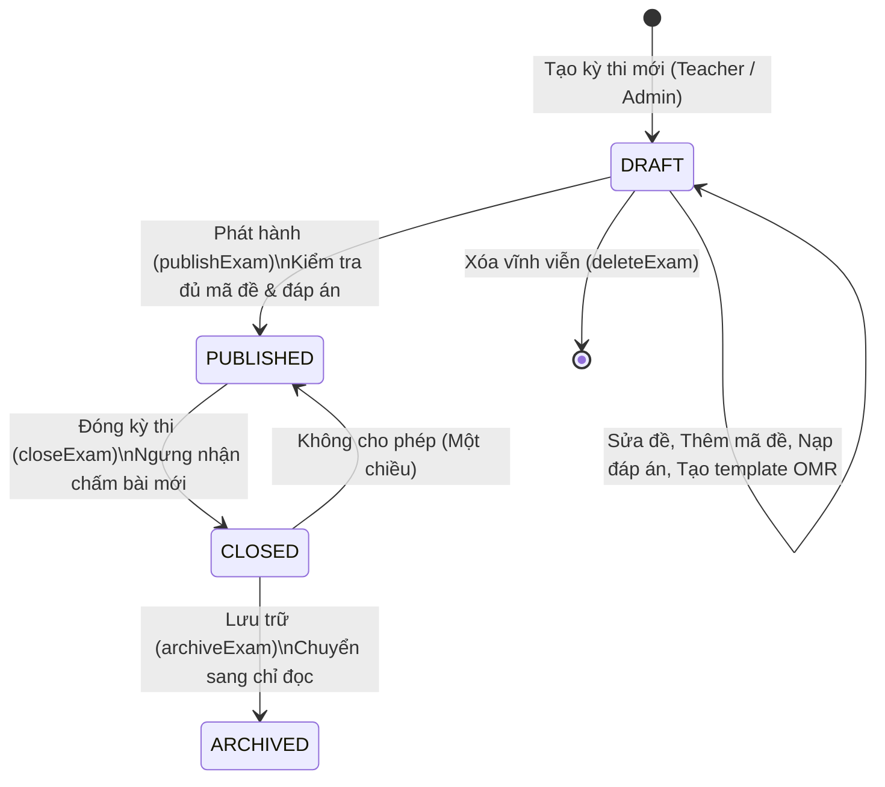
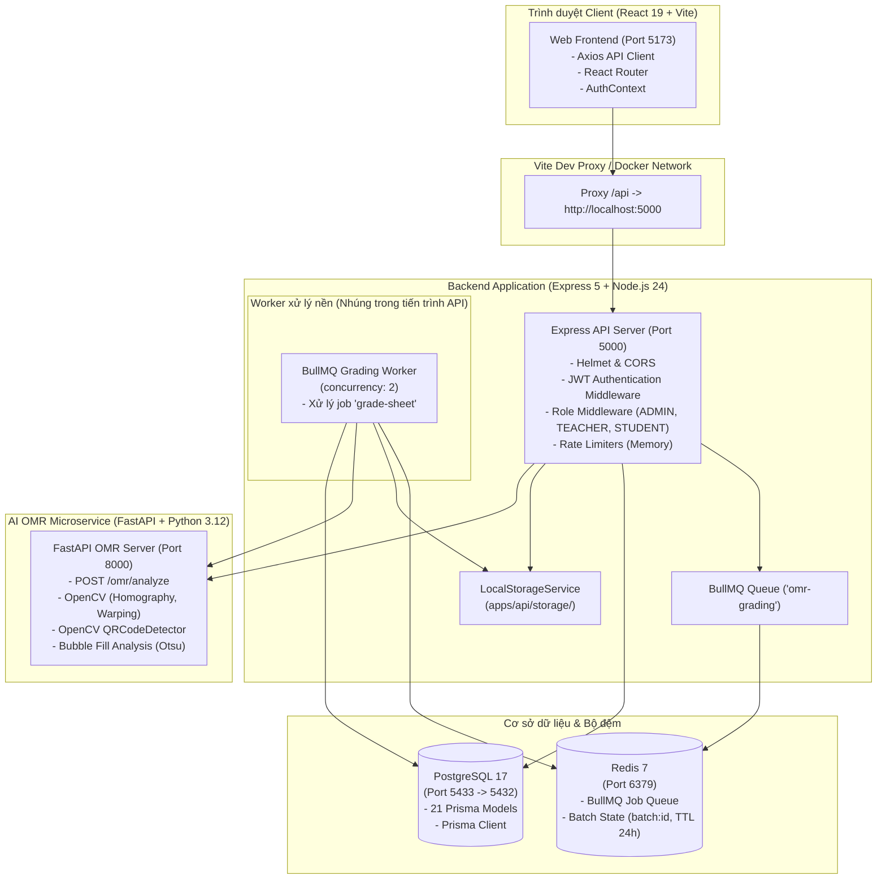

# DIGITAL EXAM GRADING — BÁO CÁO TOÀN DIỆN KHẢO SÁT HỆ THỐNG HIỆN TẠI (CURRENT SYSTEM AUDIT)

> **Căn cứ thực hiện:** Toàn bộ kết luận trong tài liệu này được đối soát trực tiếp từ mã nguồn hiện tại của dự án `DigitalExamGrading`. Tuyệt đối không dựa trên các giả định cũ, tài liệu thiết kế cũ hay phạm vi dự tính trước đây.
> **Thời điểm kiểm tra:** 2026-09-21
> **Chế độ kiểm tra:** Read-only Discovery (Khảo sát tĩnh, không can thiệp mã nguồn hay dữ liệu).

---

## 1. Tóm Tắt Tổng Quan (Executive Summary)

Dự án **DigitalExamGrading** hiện tại là một hệ thống web nguyên khối đa dịch vụ (Multi-service Web App) phục vụ việc chấm thi trắc nghiệm tự động qua phiếu OMR (Optical Mark Recognition), quản lý kỳ thi, lớp học, học sinh, giáo viên và kết quả thi.

### Những điểm phát hiện cốt lõi từ mã nguồn thực tế:
1. **Vai trò người dùng (Roles):** Hiện chỉ tồn tại duy nhất **3 vai trò**: `ADMIN`, `TEACHER`, `STUDENT`. Hoàn toàn chưa có các vai trò quản lý cấp trường như `PRINCIPAL` (Hiệu trưởng), `VICE_PRINCIPAL` (Hiệu phó), `EXAM_BOARD` (Ban Khảo thí) hay `ACADEMIC_BOARD` (Ban Chuyên môn/Hội đồng học thuật).
2. **Trạng thái tài khoản (Account Statuses):** Gồm 4 trạng thái: `ACTIVE`, `INACTIVE`, `LOCKED`, `PENDING_APPROVAL`.
3. **Mô hình Giáo viên (Teacher Model):** Model `Teacher` chỉ gồm: `id`, `userId`, `teacherCode`, `fullName`, `phone`. **Hoàn toàn không có** các trường: chức danh (`title`), vị trí công tác (`position`), tổ chuyên môn (`department`), hay khóa ngoại trực tiếp môn học (`subjectId`).
4. **Kiểm soát môn học của Giáo viên:** Quan hệ môn học được quản lý gián tiếp qua bảng phân công giảng dạy `TeachingAssignment` (Teacher + Class + Subject + AcademicYear). Tuy nhiên, logic kiểm tra tại `exam.service.js` chỉ ràng buộc môn học nếu giáo viên đã có ít nhất một phân công (`totalAssignments > 0`). Nếu giáo viên chưa có phân công nào trong hệ thống, họ có thể chọn bất kỳ môn học nào khi tạo đề thi.
5. **Loại kỳ thi (Exam Types):** **Không tồn tại** trường hay enum `examType` trong cơ sở dữ liệu. Khái niệm bài kiểm tra 15 phút, 1 tiết, thường xuyên, giữa kỳ hay cuối kỳ hiện chỉ được thể hiện gián tiếp qua tiêu đề (`title`), thời gian làm bài (`durationMinutes`: 15, 30, 45, 60, 90 phút) và mẫu phiếu (`sheetPreset`: `PRESET_15MIN_20Q`, `PRESET_15MIN_30Q`, `PRESET_45MIN_40Q`, `PRESET_TERM_50Q`, `PRESET_90MIN_60Q`, `PRESET_CUSTOM`).
6. **Kiến trúc DDD (Domain-Driven Design):** **Chưa được triển khai (ABSENT)**. Hệ thống được viết theo kiến trúc 3 tầng truyền thống (Controller - Service - Prisma ORM/Data Access). Không có thư mục `domain/`, không có Entity/Aggregate Root nghiệp vụ độc lập, không có Value Object hay Domain Event.
7. **Redis & BullMQ:**
   - **Redis:** Được cấu hình qua thư viện `ioredis`, chỉ phục vụ kết nối cho hàng đợi BullMQ và lưu tạm trạng thái đợt chấm (`batch:${batchId}` với TTL 24h). Không dùng cho bộ nhớ đệm (query cache), session hay distributed lock.
   - **BullMQ:** Queue `omr-grading` và Worker nền được định nghĩa tại `apps/api/src/queue/`. Worker chạy ngay trong cùng tiến trình với API server (`server.js`), không tách container riêng.
   - **Xử lý chấm hàng loạt (Batch Grading):** Có sự phân tách bất đối xứng giữa Frontend và Backend. Backend cung cấp endpoint `POST /api/exams/:examId/submissions/batch` đưa vào BullMQ. Tuy nhiên, Frontend (`GradingPage.jsx`) **không sử dụng** endpoint này mà tự thực hiện vòng lặp tuần tự phía client (`for` loop), gửi từng ảnh một đến endpoint đơn lẻ `POST /api/exams/:examId/submissions`.
8. **Quyền công bố kết quả (Result Publication):** Thuộc quyền sở hữu tuyệt đối của **Giáo viên trực tiếp tạo đề** (`exam.teacherId`). Admin hay giáo viên dạy cùng môn đều bị backend từ chối (HTTP 403) khi cố gắng công bố hoặc thu hồi kết quả.
9. **Lỗi luồng ảnh đại diện (Avatar Flow):** Giao diện và API đã được xây dựng nhưng tính năng tải ảnh đại diện thất bại trên trình duyệt do:
   - Header thủ công: Frontend cố định `headers: { "Content-Type": "multipart/form-data" }` làm mất chuỗi boundary của form-data trong Axios.
   - Helmet CORP: Backend áp dụng `helmet()` mặc định chặn tài nguyên cross-origin (`Cross-Origin-Resource-Policy: same-origin`), khiến trình duyệt chặn thẻ `` từ cổng 5173 gọi sang cổng 5000.
   - Định dạng URL: URL lưu trong DB là `/profile/avatar/...` trong khi route Express phục vụ là `/api/profile/avatar/...`.

---

## 2. Cấu Trúc Thư Mục Thực Tế (Repository Structure)

Cây thư mục mã nguồn được khảo sát thực tế (đã loại trừ `node_modules`, `.git`, `.venv`, dist, build, storage/cache):

```
D:\Learning_AI\DigitalExamGrading\
├── .dockerignore
├── .env.example
├── compose.yaml
├── package-lock.json
├── package.json
├── README.md
├── start-dev.bat
├── scripts/
│   ├── dev-banner.js
│   ├── dev-db.js
│   └── ensure-docker.js
├── apps/
│   ├── ai-service/
│   │   ├── Dockerfile
│   │   ├── requirements.txt
│   │   ├── app/
│   │   │   ├── __init__.py
│   │   │   ├── config.py
│   │   │   ├── main.py
│   │   │   ├── omr/
│   │   │   │   ├── __init__.py
│   │   │   │   ├── bubble_reader.py
│   │   │   │   ├── layout_mapper.py
│   │   │   │   ├── marker_detector.py
│   │   │   │   ├── perspective.py
│   │   │   │   ├── qr_reader.py
│   │   │   │   └── quality.py
│   │   │   ├── routes/
│   │   │   │   ├── __init__.py
│   │   │   │   └── omr.py
│   │   │   ├── schemas/
│   │   │   │   ├── __init__.py
│   │   │   │   └── omr.py
│   │   │   └── services/
│   │   │       ├── __init__.py
│   │   │       └── omr_service.py
│   │   └── tests/
│   │       ├── synthetic_generator.py
│   │       ├── test_bubble_calibration.py
│   │       ├── test_marker_robustness.py
│   │       └── test_omr_synthetic.py
│   ├── api/
│   │   ├── Dockerfile
│   │   ├── package.json
│   │   ├── package-lock.json
│   │   ├── .env.example
│   │   ├── prisma/
│   │   │   ├── schema.prisma
│   │   │   ├── migration_lock.toml
│   │   │   └── migrations/
│   │   │       ├── 20260907194928_init_test/
│   │   │       ├── 20260907195923_phase1_school_core/
│   │   │       ├── 20260907202110_phase2_exam_core/
│   │   │       ├── 20260907203700_fix_score_decimal_precision/
│   │   │       ├── 20260907204500_phase3_answer_sheet_template/
│   │   │       ├── 20260908040822_add_exam_submission_persistence/
│   │   │       ├── 20260908184827_add_exam_result_publication/
│   │   │       ├── 20260908192225_add_exam_candidate_student_results/
│   │   │       ├── 20260916160000_add_user_avatar_and_profile_fields/
│   │   │       └── 20260921170000_add_exam_presets_and_multi_class/
│   │   ├── src/
│   │   │   ├── app.js
│   │   │   ├── server.js
│   │   │   ├── config/
│   │   │   │   ├── cors.config.js
│   │   │   │   ├── prisma.js
│   │   │   │   ├── rate-limit.config.js
│   │   │   │   └── redis.config.js
│   │   │   ├── controllers/
│   │   │   │   ├── admin-dashboard.controller.js
│   │   │   │   ├── admin-teacher.controller.js
│   │   │   │   ├── answer-key-import.controller.js
│   │   │   │   ├── answer-sheet.controller.js
│   │   │   │   ├── auth.controller.js
│   │   │   │   ├── class.controller.js
│   │   │   │   ├── exam-analytics.controller.js
│   │   │   │   ├── exam-candidate.controller.js
│   │   │   │   ├── exam-submission-list.controller.js
│   │   │   │   ├── exam.controller.js
│   │   │   │   ├── grading.controller.js
│   │   │   │   ├── profile.controller.js
│   │   │   │   ├── result-publication.controller.js
│   │   │   │   ├── student-result.controller.js
│   │   │   │   ├── submission.controller.js
│   │   │   │   └── teacher-dashboard.controller.js
│   │   │   ├── middlewares/
│   │   │   │   ├── auth.middleware.js
│   │   │   │   ├── error.middleware.js
│   │   │   │   └── role.middleware.js
│   │   │   ├── queue/
│   │   │   │   ├── grading.queue.js
│   │   │   │   └── grading.worker.js
│   │   │   ├── routes/
│   │   │   │   ├── admin.routes.js
│   │   │   │   ├── answer-key-import.routes.js
│   │   │   │   ├── answer-sheet.routes.js
│   │   │   │   ├── auth.routes.js
│   │   │   │   ├── class.routes.js
│   │   │   │   ├── common.routes.js
│   │   │   │   ├── exam-analytics.routes.js
│   │   │   │   ├── exam-candidate.routes.js
│   │   │   │   ├── exam-submission-list.routes.js
│   │   │   │   ├── exam.routes.js
│   │   │   │   ├── grading.routes.js
│   │   │   │   ├── index.js
│   │   │   │   ├── profile.routes.js
│   │   │   │   ├── result-publication.routes.js
│   │   │   │   ├── student-result.routes.js
│   │   │   │   ├── submission.routes.js
│   │   │   │   └── teacher-dashboard.routes.js
│   │   │   ├── schemas/
│   │   │   │   ├── admin-teacher.schema.js
│   │   │   │   ├── answer-key-import.schema.js
│   │   │   │   ├── answer-sheet.schema.js
│   │   │   │   ├── auth.schema.js
│   │   │   │   ├── class.schema.js
│   │   │   │   ├── exam-candidate.schema.js
│   │   │   │   ├── exam.schema.js
│   │   │   │   ├── profile.schema.js
│   │   │   │   ├── result-publication.schema.js
│   │   │   │   └── submission.schema.js
│   │   │   ├── services/
│   │   │   │   ├── admin-dashboard.service.js
│   │   │   │   ├── admin-teacher.service.js
│   │   │   │   ├── answer-key-import.service.js
│   │   │   │   ├── answer-key.service.js
│   │   │   │   ├── answer-sheet-pdf.service.js
│   │   │   │   ├── answer-sheet.service.js
│   │   │   │   ├── auth.service.js
│   │   │   │   ├── class.service.js
│   │   │   │   ├── exam-analytics.service.js
│   │   │   │   ├── exam-candidate.service.js
│   │   │   │   ├── exam-code.service.js
│   │   │   │   ├── exam.service.js
│   │   │   │   ├── grading.service.js
│   │   │   │   ├── omr-client.service.js
│   │   │   │   ├── profile.service.js
│   │   │   │   ├── result-export.service.js
│   │   │   │   ├── result-publication.service.js
│   │   │   │   ├── student-enrollment.service.js
│   │   │   │   ├── student-excel-import.service.js
│   │   │   │   ├── student-result.service.js
│   │   │   │   ├── submission-list.service.js
│   │   │   │   ├── submission-review.service.js
│   │   │   │   ├── submission.service.js
│   │   │   │   ├── teacher-dashboard.service.js
│   │   │   │   └── storage/
│   │   │   │       ├── local-storage.service.js
│   │   │   │       └── storage.service.js
│   │   │   └── utils/
│   │   │       ├── exam-code.js
│   │   │       ├── sbd-generator.js
│   │   │       ├── teacher-code.js
│   │   │       └── vietnamese-sort.js
│   │   └── tests/
│   │       ├── setup-test-env.js
│   │       └── *.test.js (18 test suites)
│   └── web/
│       ├── Dockerfile
│       ├── package.json
│       ├── vite.config.js
│       ├── .env.example
│       └── src/
│           ├── App.jsx
│           ├── main.jsx
│           ├── api/client.js
│           ├── context/AuthContext.jsx
│           ├── components/
│           │   ├── AppHeader.jsx
│           │   ├── ExamStatusBadge.jsx
│           │   ├── RequireRole.jsx
│           │   ├── admin/TeacherModals.jsx
│           │   ├── classes/StudentExcelImportModal.jsx, StudentModals.jsx
│           │   ├── grading/GradingIdentityModal.jsx, GradingManualReviewModal.jsx
│           │   └── ui/ (Alert, Badge, Breadcrumbs, Button, Card, EmptyState, Input, Modal)
│           ├── pages/ (15 page components)
│           └── utils/ (enum-map.js, error-map.js, slug.js)
```

*Lưu ý xác nhận:* Hoàn toàn không tồn tại các thư mục `domain/`, `workers/`, `queues/` ở cấp gốc repository.

---

## 3. Bảng Kiểm Kê Công Nghệ (Technology Inventory)

| Công nghệ / Thư viện | Phiên bản (từ source) | Nơi sử dụng | Mục đích sử dụng | Trạng thái thực tế |
|---|---|---|---|---|
| **React** | `^19.2.8` | `apps/web` | Thư viện xây dựng giao diện người dùng | **ACTIVE** |
| **Vite** | `^8.2.2` | `apps/web` | Build tool và Dev Server | **ACTIVE** |
| **Tailwind CSS** | `^4.3.3` | `apps/web` | Framework CSS giao diện | **ACTIVE** |
| **React Router** | `^7.18.3` | `apps/web` | Định tuyến SPA (BrowserRouter, Routes) | **ACTIVE** |
| **Axios** | `^1.20.0` | `apps/web` | HTTP client giao tiếp API | **ACTIVE** |
| **Lucide React** | `^1.42.0` | `apps/web` | Icon bộ giao diện | **ACTIVE** |
| **Express** | `^5.2.1` | `apps/api` | Web server backend | **ACTIVE** |
| **Prisma** | `^7.10.0` | `apps/api` | ORM truy cập CSDL PostgreSQL | **ACTIVE** |
| **PostgreSQL** | `17-alpine` | `compose.yaml` | Cơ sở dữ liệu quan hệ chính | **ACTIVE** |
| **Redis** | `7-alpine` (Docker), `ioredis ^6.0.0` | `compose.yaml`, `apps/api` | Bộ lưu trữ cho BullMQ & trạng thái batch | **ACTIVE** (nhưng dùng tối thiểu) |
| **BullMQ** | `^6.3.6` | `apps/api/src/queue` | Hàng đợi tác vụ chấm bài theo lô | **ACTIVE** (backend sẵn sàng, FE chưa nối) |
| **FastAPI** | `0.141.1` | `apps/ai-service` | Web framework cho AI OMR Service | **ACTIVE** |
| **Uvicorn** | `0.52.4` | `apps/ai-service` | ASGI Server chạy FastAPI | **ACTIVE** |
| **OpenCV (cv2)** | `opencv-python-headless 5.0.0.93` | `apps/ai-service` | Xử lý ảnh, homography, tìm marker, bóc tách bong bóng, giải mã QR | **ACTIVE** |
| **NumPy** | `2.4.6` | `apps/ai-service` | Tính toán ma trận mảng điểm, độ phủ điểm ảnh | **ACTIVE** |
| **Pillow (PIL)** | `12.3.0` | `apps/ai-service` | Thư viện xử lý ảnh phụ trợ | **ACTIVE** |
| **PyMuPDF (fitz)** | `1.28.2` | `apps/ai-service` | Xử lý tài liệu PDF trên Python | **INSTALLED_BUT_UNUSED** (OMR chỉ nhận jpg/png) |
| **PyZbar** | Không có | `apps/ai-service` | Thư viện đọc mã vạch / QR | **NOT_PRESENT** (Dùng `cv2.QRCodeDetector`) |
| **bcrypt** | `^6.0.0` | `apps/api` | Băm mật khẩu người dùng (12 rounds) | **ACTIVE** |
| **jsonwebtoken** | `^9.0.3` | `apps/api` | Ký và xác thực Access/Refresh Token JWT | **ACTIVE** |
| **Zod** | `^4.5.4` | `apps/api` | Validation dữ liệu request | **ACTIVE** |
| **PDFKit** | `^0.20.2` | `apps/api` | Sinh file PDF mẫu phiếu trả lời OMR vector | **ACTIVE** |
| **ExcelJS** | `^4.4.0` | `apps/api` | Xuất kết quả thi ra XLSX, đọc file học sinh | **ACTIVE** |
| **csv-parse** | `^7.0.2` | `apps/api` | Đọc file CSV đáp án | **ACTIVE** |
| **Multer** | `^2.3.0` | `apps/api` | Nhận file tải lên (memoryStorage) | **ACTIVE** |
| **Helmet** | `^8.3.0` | `apps/api` | Thiết lập HTTP security headers | **ACTIVE** |
| **express-rate-limit** | `^8.7.0` | `apps/api` | Giới hạn tần suất request (bộ nhớ in-memory) | **ACTIVE** |
| **qrcode** | `^1.5.4` | `apps/api` | Sinh mã QR nhúng vào phiếu OMR PDF | **ACTIVE** |
| **AWS S3 / MinIO** | Không có | `apps/api` | Lưu trữ đám mây | **NOT_PRESENT** (Đang dùng `LocalStorageService`) |
| **WebSocket / SSE** | Không có | `apps/api`, `apps/web` | Giao tiếp thời gian thực | **NOT_PRESENT** (Frontend dùng Polling HTTP) |

---

## 4. Kiến Trúc Môi Trường & Khởi Chạy (Runtime Architecture)

### 4.1 Khởi chạy Local Dev (`npm run dev`)
Theo file root [package.json](file:///D:/Learning_AI/DigitalExamGrading/package.json) và [scripts/dev-db.js](file:///D:/Learning_AI/DigitalExamGrading/scripts/dev-db.js):
- Bước 1: `dev:docker` chạy `node scripts/ensure-docker.js` kiểm tra Docker daemon.
- Bước 2: `dev:db` chạy `docker compose up -d --wait postgres redis`.
- Bước 3: `dev:banner` in thông tin cổng dịch vụ.
- Bước 4: Dùng thư viện `concurrently` chạy đồng thời 3 dịch vụ:
  1. **WEB:** `npm --prefix apps/web run dev -- --host 0.0.0.0`
  2. **API:** `npm --prefix apps/api run dev` (chạy qua `nodemon src/server.js`)
  3. **AI:** `cd apps/ai-service && .venv\Scripts\python.exe -m uvicorn app.main:app --host 127.0.0.1 --port 8000`

### 4.2 Cổng & Địa chỉ mạng (Ports & Bindings)
Đối chiếu từ [compose.yaml](file:///D:/Learning_AI/DigitalExamGrading/compose.yaml), [vite.config.js](file:///D:/Learning_AI/DigitalExamGrading/apps/web/vite.config.js), và `server.js`:
- **Web Frontend:** Cổng `5173` (`http://localhost:5173`). Nginx trong container map ra `5173:80`.
- **Backend API:** Cổng `5000` (`http://localhost:5000` hoặc proxy `/api` từ Vite).
- **FastAPI AI Service:** Cổng `8000` (`http://localhost:8000` hoặc internal docker `http://ai-service:8000`).
- **PostgreSQL Database:** Host port `5433` map vào container `5432` (`127.0.0.1:${POSTGRES_PORT:-5433}:5432`). Mặc định cổng ngoài là `5433` (để tránh xung đột với Postgres cài sẵn trên máy host).
- **Redis:** Host port `6379` map vào container `6379` (`127.0.0.1:6379:6379`).

### 4.3 Tiến trình xử lý nền (Worker Process)
- **Không có tiến trình Worker độc lập:** File `compose.yaml` không có container worker. File `package.json` không có lệnh khởi động worker riêng.
- **Tiến trình worker nhúng (In-process Worker):** Tại [apps/api/src/server.js](file:///D:/Learning_AI/DigitalExamGrading/apps/api/src/server.js#L44-L50), khi HTTP server lắng nghe, module `queue/grading.worker.js` được import động và gọi `initGradingWorker()`. Worker chạy ngầm trong cùng tiến trình Node.js của API.

---

## 5. Vai Trò & Trạng Thái Tài Khoản Hiện Tại (Current Roles & Account Statuses)

Căn cứ định nghĩa Enum trong [prisma/schema.prisma](file:///D:/Learning_AI/DigitalExamGrading/apps/api/prisma/schema.prisma#L13-L24):

### 5.1 Vai trò người dùng (`UserRole`)
Chỉ có duy nhất 3 giá trị:
1. `ADMIN`: Quản trị viên hệ thống toàn quyền.
2. `TEACHER`: Giáo viên giảng dạy, tạo đề, chấm bài OMR và xem phân tích.
3. `STUDENT`: Học sinh tra cứu kỳ thi và xem kết quả sau khi công bố.

*Khẳng định:* Hoàn toàn **chưa có** các vai trò: `PRINCIPAL`, `VICE_PRINCIPAL`, `EXAM_BOARD`, `ACADEMIC_BOARD`, `HEAD_OF_DEPARTMENT`.

### 5.2 Trạng thái tài khoản (`UserStatus`)
Bao gồm 4 giá trị:
1. `ACTIVE`: Tài khoản hoạt động bình thường, được phép đăng nhập.
2. `INACTIVE`: Tài khoản chưa kích hoạt hoặc bị ngưng hoạt động.
3. `LOCKED`: Tài khoản bị khóa bởi Quản trị viên (bị thu hồi token, từ chối đăng nhập ngay cả khi token còn hạn).
4. `PENDING_APPROVAL`: Trạng thái chờ Quản trị viên duyệt (được gán tự động khi giáo viên tự đăng ký qua trang `/register-teacher`).

---

## 6. Bản Đồ Định Tuyến Frontend (Frontend Route Map)

Đối chiếu trực tiếp từ [apps/web/src/App.jsx](file:///D:/Learning_AI/DigitalExamGrading/apps/web/src/App.jsx):

| Route Path | Vai trò cho phép (`roles`) | Component Trang | Mục đích chức năng | Các Endpoint API chính gọi | Trạng thái triển khai |
|---|---|---|---|---|---|
| `/login` | Public (Khách) | `LoginPage` | Đăng nhập hệ thống | `POST /auth/login` | **IMPLEMENTED** |
| `/register-teacher` | Public (Khách) | `RegisterTeacherPage` | Giáo viên đăng ký tài khoản mới | `GET /auth/next-teacher-code`, `POST /auth/register-teacher` | **IMPLEMENTED** |
| `/admin/dashboard` | `ADMIN` | `AdminDashboardPage` | Bảng điều khiển giám sát toàn trường | `GET /admin/dashboard` | **IMPLEMENTED** |
| `/admin/teachers` | `ADMIN` | `AdminTeacherListPage` | Danh sách & quản lý tài khoản giáo viên | `GET /admin/teachers`, `POST /admin/teachers`, `PATCH /admin/teachers/:id`, `POST /admin/teachers/:id/lock`, `POST /admin/teachers/:id/unlock`, `POST /admin/teachers/:id/reset-password`, `POST /admin/teachers/:id/approve`, `POST /admin/teachers/:id/reject`, `DELETE /admin/teachers/:id` | **IMPLEMENTED** |
| `/profile` | `TEACHER`, `STUDENT`, `ADMIN` | `TeacherProfilePage` | Xem/sửa hồ sơ, đổi mật khẩu, ảnh đại diện | `GET /profile`, `PATCH /profile`, `POST /profile/avatar`, `POST /profile/change-password` | **PARTIAL** (Upload avatar lỗi) |
| `/classes` | `TEACHER`, `ADMIN` | `TeacherClassesPage` | Quản lý danh sách lớp học và học sinh | `GET /classes/grades`, `GET /classes`, `POST /classes`, `POST /classes/batch`, `PATCH /classes/:id`, `DELETE /classes/:id`, `GET /classes/:id/students`, `POST /classes/:id/students/import-preview`, `POST /classes/:id/students/import`, `POST /classes/:id/standardize-sbd` | **IMPLEMENTED** |
| `/exams` | `TEACHER`, `ADMIN` | `ExamListPage` | Danh sách kỳ thi/đề thi | `GET /exams`, `POST /exams/bulk-delete`, `GET /classes`, `GET /subjects` | **IMPLEMENTED** |
| `/exams/new` | `TEACHER`, `ADMIN` | `ExamCreatePage` | Khởi tạo đề thi / bài kiểm tra mới | `GET /teacher/assignments` (hoặc `/subjects`, `/classes`, `/grades`), `POST /classes/batch`, `POST /exams` | **IMPLEMENTED** |
| `/exams/:examId` | `TEACHER`, `ADMIN` | `ExamDetailPage` | Chi tiết đề thi, mã đề, đáp án, tạo template OMR, phát hành | `GET /exams/:id`, `PATCH /exams/:id`, `POST /exams/:id/publish`, `POST /exams/:id/close`, `POST /exams/:id/codes`, `PUT /exams/:id/codes/:cId/answer-key`, `POST /exams/:id/answer-sheet-template`, `GET /exams/:id/answer-sheet-template/pdf`, `POST /exams/:id/answer-key/import` | **IMPLEMENTED** |
| `/exams/:examId/submissions` | `TEACHER`, `ADMIN` | `ExamSubmissionsPage` | Danh sách bài thi đã nộp, công bố kết quả, xuất file Excel | `GET /exams/:id`, `GET /exams/:id/submissions`, `GET /exams/:id/submissions/summary`, `GET /exams/:id/results/publication`, `POST /exams/:id/results/publish`, `POST /exams/:id/results/unpublish`, `GET /exams/:id/results/export.xlsx` | **IMPLEMENTED** |
| `/exams/:examId/analytics` | `TEACHER`, `ADMIN` | `ExamAnalyticsPage` | Phân tích phổ điểm, độ phân cách, độ khó câu hỏi | `GET /exams/:id/analytics` | **IMPLEMENTED** |
| `/exams/:examId/:slug` | `TEACHER`, `ADMIN` | `ExamDetailPage` | Route thân thiện SEO mở trang chi tiết đề thi | Tương tự `/exams/:examId` | **IMPLEMENTED** |
| `/grade` | `TEACHER` | `GradingPage` | Chấm bài thi OMR (đơn lẻ hoặc theo lô) | `GET /exams`, `GET /exams/:id/answer-sheet-template`, `POST /exams/:id/submissions`, `GET /exams/:id/answer-sheet-template/pdf`, `GET /exams/:id/submissions/summary` | **IMPLEMENTED** |
| `/submissions/:submissionId` | `TEACHER`, `ADMIN` | `GradingPage` | Xem lại chi tiết bài chấm, duyệt phúc khảo câu hỏi / SBD | `GET /submissions/:id`, `GET /submissions/:id/image`, `GET /submissions/:id/answers/:qNum/review-crop`, `PATCH /submissions/:id/review`, `PATCH /submissions/:id/identity`, `GET /submissions/:id/audit` | **IMPLEMENTED** |
| `/student/exams` | `STUDENT` | `StudentExamsPage` | Cổng học sinh: Danh sách kỳ thi của lớp | `GET /student/exams` | **IMPLEMENTED** |
| `/student/results` | `STUDENT` | `StudentResultsPage` | Cổng học sinh: Danh sách kết quả điểm đã công bố | `GET /student/results` | **IMPLEMENTED** |
| `/student/results/:examId` | `STUDENT` | `StudentResultDetailPage` | Cổng học sinh: Chi tiết bài thi và câu trả lời | `GET /student/results/:examId` | **IMPLEMENTED** |
| `*` | Any | `RootRedirect` | Điều hướng gốc theo vai trò người dùng | None (chuyển hướng client) | **IMPLEMENTED** |

---

## 7. Bản Đồ Tuyến Backend API (Backend API Route Map)

Đối chiếu trực tiếp từ [apps/api/src/routes/](file:///D:/Learning_AI/DigitalExamGrading/apps/api/src/routes/):

| Phương thức | Đường dẫn API | Vai trò yêu cầu | Controller phụ trách | Mục đích nghiệp vụ |
|---|---|---|---|---|
| **GET** | `/api/health` | Public | Inline handler | Kiểm tra trạng thái API, RAM, độ trễ DB |
| **POST** | `/api/auth/login` | Public (Rate Limited) | `auth.controller.js` | Đăng nhập, cấp Access + Refresh Token |
| **POST** | `/api/auth/register-teacher` | Public (Rate Limited) | `auth.controller.js` | Giáo viên đăng ký tài khoản (chờ duyệt) |
| **GET** | `/api/auth/next-teacher-code` | Public | `auth.controller.js` | Gợi ý mã giáo viên tự động theo môn |
| **GET** | `/api/auth/me` | Authenticated | `auth.controller.js` | Lấy thông tin tài khoản đang đăng nhập |
| **POST** | `/api/auth/refresh` | Public | `auth.controller.js` | Cấp mới Access Token bằng Refresh Token |
| **POST** | `/api/auth/logout` | Public | `auth.controller.js` | Thu hồi Refresh Token |
| **GET** | `/api/admin/dashboard` | `ADMIN` | `admin-dashboard.controller.js` | Thống kê số liệu toàn trường cho BGH/Admin |
| **GET** | `/api/admin/teachers` | `ADMIN` | `admin-teacher.controller.js` | Danh sách giáo viên, tìm kiếm, lọc trạng thái |
| **POST** | `/api/admin/teachers` | `ADMIN` | `admin-teacher.controller.js` | Tạo tài khoản giáo viên mới |
| **GET** | `/api/admin/teachers/:teacherId` | `ADMIN` | `admin-teacher.controller.js` | Xem chi tiết thông tin một giáo viên |
| **PATCH** | `/api/admin/teachers/:teacherId` | `ADMIN` | `admin-teacher.controller.js` | Cập nhật thông tin giáo viên |
| **POST** | `/api/admin/teachers/:teacherId/lock` | `ADMIN` | `admin-teacher.controller.js` | Khóa tài khoản giáo viên và thu hồi token |
| **POST** | `/api/admin/teachers/:teacherId/unlock` | `ADMIN` | `admin-teacher.controller.js` | Mở khóa tài khoản giáo viên |
| **POST** | `/api/admin/teachers/:teacherId/reset-password` | `ADMIN` | `admin-teacher.controller.js` | Đặt lại mật khẩu giáo viên |
| **POST** | `/api/admin/teachers/:teacherId/approve` | `ADMIN` | `admin-teacher.controller.js` | Phê duyệt giáo viên tự đăng ký |
| **POST** | `/api/admin/teachers/:teacherId/reject` | `ADMIN` | `admin-teacher.controller.js` | Từ chối đăng ký & xóa tài khoản chờ duyệt |
| **DELETE** | `/api/admin/teachers/:teacherId` | `ADMIN` | `admin-teacher.controller.js` | Xóa vĩnh viễn giáo viên (phải LOCKED trước) |
| **POST** | `/api/admin/teachers/bulk-delete-locked` | `ADMIN` | `admin-teacher.controller.js` | Xóa hàng loạt giáo viên đã bị khóa |
| **GET** | `/api/profile/avatar/:filename` | Public | `profile.controller.js` | Stream ảnh đại diện phục vụ thẻ `` |
| **GET** | `/api/profile` | `TEACHER`, `STUDENT`, `ADMIN` | `profile.controller.js` | Lấy hồ sơ cá nhân |
| **PATCH** | `/api/profile` | `TEACHER`, `STUDENT`, `ADMIN` | `profile.controller.js` | Cập nhật họ tên, số điện thoại |
| **POST** | `/api/profile/avatar` | `TEACHER`, `STUDENT`, `ADMIN` | `profile.controller.js` | Tải lên file ảnh đại diện mới |
| **POST** | `/api/profile/change-password` | `TEACHER`, `STUDENT`, `ADMIN` | `profile.controller.js` | Đổi mật khẩu người dùng |
| **GET** | `/api/classes/grades` | `TEACHER`, `ADMIN` | `class.controller.js` | Lấy danh mục các khối học |
| **GET** | `/api/classes` | `TEACHER`, `ADMIN` | `class.controller.js` | Danh sách lớp học kèm sĩ số học sinh |
| **POST** | `/api/classes` | `TEACHER`, `ADMIN` | `class.controller.js` | Tạo mới 1 lớp học |
| **POST** | `/api/classes/batch` | `TEACHER`, `ADMIN` | `class.controller.js` | Tạo hàng loạt lớp theo danh sách hoặc dãy số |
| **POST** | `/api/classes/bulk-delete` | `TEACHER`, `ADMIN` | `class.controller.js` | Xóa hàng loạt lớp học |
| **PATCH** | `/api/classes/:classId` | `TEACHER`, `ADMIN` | `class.controller.js` | Đổi tên hoặc sửa khối của lớp |
| **DELETE** | `/api/classes/:classId` | `TEACHER`, `ADMIN` | `class.controller.js` | Xóa 1 lớp học |
| **GET** | `/api/classes/:classId/students` | `TEACHER`, `ADMIN` | `class.controller.js` | Danh sách học sinh trong lớp |
| **POST** | `/api/classes/:classId/students` | `TEACHER`, `ADMIN` | `class.controller.js` | Thêm 1 học sinh vào lớp |
| **DELETE** | `/api/classes/:classId/students` | `TEACHER`, `ADMIN` | `class.controller.js` | Xóa toàn bộ học sinh khỏi lớp |
| **POST** | `/api/classes/:classId/students/bulk-delete` | `TEACHER`, `ADMIN` | `class.controller.js` | Xóa danh sách học sinh được chọn khỏi lớp |
| **PATCH** | `/api/classes/:classId/students/:studentId` | `TEACHER`, `ADMIN` | `class.controller.js` | Cập nhật thông tin học sinh |
| **DELETE** | `/api/classes/:classId/students/:studentId` | `TEACHER`, `ADMIN` | `class.controller.js` | Xóa 1 học sinh khỏi lớp |
| **POST** | `/api/classes/:classId/standardize-sbd` | `TEACHER`, `ADMIN` | `class.controller.js` | Đánh lại SBD thông minh theo bảng chữ cái VN |
| **POST** | `/api/classes/:classId/students/import-preview` | `TEACHER`, `ADMIN` | `class.controller.js` | Đọc trước file Excel danh sách học sinh |
| **POST** | `/api/classes/:classId/students/import` | `TEACHER`, `ADMIN` | `class.controller.js` | Nhập học sinh chính thức từ Excel vào lớp |
| **GET** | `/api/subjects` | `TEACHER`, `ADMIN` | `common.routes.js` | Danh sách môn học cho dropdown chọn đề |
| **GET** | `/api/grades` | `TEACHER`, `ADMIN` | `common.routes.js` | Danh sách khối học cho dropdown |
| **GET** | `/api/exams` | `TEACHER`, `ADMIN` | `exam.controller.js` | Danh sách kỳ thi (Teacher lọc theo quyền/lớp) |
| **POST** | `/api/exams` | `TEACHER`, `ADMIN` | `exam.controller.js` | Khởi tạo kỳ thi mới (DRAFT) |
| **POST** | `/api/exams/bulk-delete` | `ADMIN` (chỉ Admin) | `exam.controller.js` | Xóa hàng loạt kỳ thi nháp |
| **GET** | `/api/exams/:examId` | `TEACHER`, `ADMIN` | `exam.controller.js` | Xem chi tiết 1 kỳ thi |
| **PATCH** | `/api/exams/:examId` | `TEACHER`, `ADMIN` | `exam.controller.js` | Cập nhật cấu hình kỳ thi (chỉ khi DRAFT) |
| **DELETE** | `/api/exams/:examId` | `TEACHER`, `ADMIN` | `exam.controller.js` | Xóa kỳ thi (chỉ khi DRAFT) |
| **POST** | `/api/exams/:examId/clone` | `TEACHER`, `ADMIN` | `exam.controller.js` | Nhân bản đề thi và mã đề sang bản nháp mới |
| **POST** | `/api/exams/:examId/publish` | `TEACHER`, `ADMIN` | `exam.controller.js` | Phát hành đề thi (DRAFT -> PUBLISHED) |
| **POST** | `/api/exams/:examId/close` | `TEACHER`, `ADMIN` | `exam.controller.js` | Đóng kỳ thi, ngưng nhận bài (PUBLISHED -> CLOSED)|
| **POST** | `/api/exams/:examId/archive` | `TEACHER`, `ADMIN` | `exam.controller.js` | Lưu trữ kỳ thi (CLOSED -> ARCHIVED) |
| **POST** | `/api/exams/:examId/codes` | `TEACHER`, `ADMIN` | `exam.controller.js` | Thêm mã đề thi (tối đa 3 chữ số) |
| **GET** | `/api/exams/:examId/codes` | `TEACHER`, `ADMIN` | `exam.controller.js` | Danh sách mã đề của kỳ thi |
| **DELETE** | `/api/exams/:examId/codes/:codeId` | `TEACHER`, `ADMIN` | `exam.controller.js` | Xóa mã đề (chỉ khi DRAFT) |
| **PUT** | `/api/exams/:examId/codes/:codeId/answer-key` | `TEACHER`, `ADMIN` | `exam.controller.js` | Lưu đáp án chuẩn cho mã đề |
| **GET** | `/api/exams/:examId/codes/:codeId/answer-key` | `TEACHER`, `ADMIN` | `exam.controller.js` | Lấy đáp án chuẩn của mã đề |
| **GET** | `/api/exams/:examId/answer-key/import-template` | `TEACHER`, `ADMIN` | `answer-key-import.controller.js` | Tải file Excel/CSV mẫu đáp án |
| **POST** | `/api/exams/:examId/answer-key/import/preview` | `TEACHER`, `ADMIN` | `answer-key-import.controller.js` | Xem trước kết quả parse file đáp án |
| **POST** | `/api/exams/:examId/answer-key/import` | `TEACHER`, `ADMIN` | `answer-key-import.controller.js` | Nạp đáp án hàng loạt từ file Excel/CSV |
| **POST** | `/api/exams/:examId/answer-sheet-template` | `TEACHER`, `ADMIN` | `answer-sheet.controller.js` | Khởi tạo cấu trúc hình học mẫu phiếu OMR |
| **GET** | `/api/exams/:examId/answer-sheet-template` | `TEACHER`, `ADMIN` | `answer-sheet.controller.js` | Lấy metadata mẫu phiếu OMR |
| **GET** | `/api/exams/:examId/answer-sheet-template/layout` | `TEACHER`, `ADMIN` | `answer-sheet.controller.js` | Lấy toàn bộ JSON tọa độ bubble |
| **GET** | `/api/exams/:examId/answer-sheet-template/pdf` | `TEACHER`, `ADMIN` | `answer-sheet.controller.js` | Tải file PDF vector phiếu OMR in ấn |
| **POST** | `/api/exams/:examId/grade-image` | `TEACHER` | `grading.controller.js` | Chấm thử không lưu DB (stateless) |
| **POST** | `/api/exams/:examId/submissions` | `TEACHER` | `submission.controller.js` | Chấm và lưu bài nộp đơn lẻ vào CSDL |
| **POST** | `/api/exams/:examId/submissions/batch` | `TEACHER` | `submission.controller.js` | Đẩy danh sách tối đa 50 ảnh vào hàng đợi BullMQ |
| **GET** | `/api/exams/:examId/batches/:batchId` | `TEACHER` | `submission.controller.js` | Lấy tiến độ và kết quả đợt chấm BullMQ |
| **GET** | `/api/exams/:examId/submissions` | `TEACHER`, `ADMIN` | `exam-submission-list.controller.js`| Danh sách bài nộp của kỳ thi (phân trang, lọc) |
| **GET** | `/api/exams/:examId/submissions/summary` | `TEACHER`, `ADMIN` | `exam-submission-list.controller.js`| Thống kê tổng số bài, số bài cần duyệt |
| **GET** | `/api/exams/:examId/results/publication` | `TEACHER`, `ADMIN` | `result-publication.controller.js` | Kiểm tra điều kiện công bố kết quả |
| **GET** | `/api/exams/:examId/results/publication-logs` | `TEACHER`, `ADMIN` | `result-publication.controller.js` | Xem lịch sử nhật ký công bố |
| **POST** | `/api/exams/:examId/results/publish` | `TEACHER` (chủ đề) | `result-publication.controller.js` | Công bố kết quả cho học sinh xem |
| **POST** | `/api/exams/:examId/results/unpublish` | `TEACHER` (chủ đề) | `result-publication.controller.js` | Thu hồi công bố kết quả |
| **GET** | `/api/exams/:examId/results/export.xlsx` | `TEACHER`, `ADMIN` | `result-publication.controller.js` | Xuất bảng điểm kỳ thi ra Excel |
| **GET** | `/api/exams/:examId/results/export.csv` | `TEACHER`, `ADMIN` | `result-publication.controller.js` | Xuất bảng điểm kỳ thi ra CSV |
| **GET** | `/api/exams/:examId/candidates` | `TEACHER`, `ADMIN` | `exam-candidate.controller.js` | Danh sách thí sinh gắn với kỳ thi |
| **GET** | `/api/exams/:examId/eligible-students` | `TEACHER`, `ADMIN` | `exam-candidate.controller.js` | Danh sách học sinh hợp lệ để thêm thí sinh |
| **POST** | `/api/exams/:examId/candidates` | `TEACHER`, `ADMIN` | `exam-candidate.controller.js` | Gán thủ công học sinh làm thí sinh |
| **POST** | `/api/exams/:examId/candidates/auto-assign`| `TEACHER`, `ADMIN` | `exam-candidate.controller.js` | Tự động gán thí sinh từ danh sách lớp |
| **DELETE** | `/api/exams/:examId/candidates/:candidateId` | `TEACHER`, `ADMIN` | `exam-candidate.controller.js` | Hủy gán thí sinh |
| **GET** | `/api/exams/:examId/analytics` | `TEACHER`, `ADMIN` | `exam-analytics.controller.js` | Báo cáo phân tích chất lượng bài thi |
| **GET** | `/api/submissions/:submissionId` | `TEACHER`, `ADMIN` | `submission.controller.js` | Xem chi tiết 1 bài thi đã chấm |
| **DELETE** | `/api/submissions/:submissionId` | `TEACHER`, `ADMIN` | `submission.controller.js` | Xóa bài nộp (chỉ khi chưa công bố) |
| **GET** | `/api/submissions/:submissionId/image` | `TEACHER`, `ADMIN` | `submission.controller.js` | Stream ảnh gốc bài thi (có auth) |
| **GET** | `/api/submissions/:submissionId/answers/:questionNumber/review-crop` | `TEACHER`, `ADMIN` | `submission.controller.js` | Stream ảnh cắt ô tô có nghi vấn |
| **PATCH** | `/api/submissions/:submissionId/review` | `TEACHER`, `ADMIN` | `submission.controller.js` | Giáo viên sửa đáp án nhận diện OMR |
| **PATCH** | `/api/submissions/:submissionId/identity` | `TEACHER`, `ADMIN` | `submission.controller.js` | Giáo viên sửa/xác nhận SBD học sinh |
| **GET** | `/api/submissions/:submissionId/audit` | `TEACHER`, `ADMIN` | `submission.controller.js` | Xem nhật ký chỉnh sửa của bài thi |
| **GET** | `/api/teacher/dashboard` | `TEACHER`, `ADMIN` | `teacher-dashboard.controller.js` | Thống kê việc chấm bài của giáo viên |
| **GET** | `/api/teacher/assignments` | `TEACHER`, `ADMIN` | `teacher-dashboard.controller.js` | Danh sách lớp & môn được phân công |
| **GET** | `/api/student/exams` | `STUDENT` | `student-result.controller.js` | Học sinh xem các kỳ thi của lớp |
| **GET** | `/api/student/results` | `STUDENT` | `student-result.controller.js` | Học sinh xem các kết quả đã công bố |
| **GET** | `/api/student/results/:examId` | `STUDENT` | `student-result.controller.js` | Học sinh xem chi tiết điểm bài thi |

---

## 8. Mô Hình Cơ Sở Dữ Liệu Thực Tế (Prisma Models)

Hệ thống có tổng cộng **21 Models**, phân bổ theo 6 nhóm nghiệp vụ:

### 8.1 Nhóm Xác thực & Người dùng (Auth Domain)
- `User`: Tài khoản người dùng cơ bản (`id`, `email`, `passwordHash`, `role`, `status`, `avatarUrl`, `fullName`, `phone`, `createdAt`, `updatedAt`).
- `RefreshToken`: Quản lý phiên đăng nhập có xoay vòng token (`id`, `tokenHash`, `userId`, `expiresAt`, `revokedAt`).

### 8.2 Nhóm Học đường (School Core Domain)
- `Teacher`: Hồ sơ giáo viên (`id`, `userId` [unique], `teacherCode` [unique], `fullName`, `phone`, `createdAt`, `updatedAt`). Xóa User thì xóa Teacher cascade.
- `Student`: Hồ sơ học sinh (`id`, `userId` [unique], `studentCode` [unique], `fullName`, `dateOfBirth`, `initialPassword`, `createdAt`, `updatedAt`).
- `AcademicYear`: Năm học (`id`, `name` [unique], `startDate`, `endDate`).
- `Semester`: Học kỳ (`id`, `name`, `academicYearId`, `startDate`, `endDate`). Unique: `[academicYearId, name]`.
- `Grade`: Khối học (`id`, `level` [unique: 6..12], `name` [unique]).
- `Class`: Lớp học (`id`, `name`, `gradeId`, `academicYearId`). Unique: `[name, academicYearId]`.
- `StudentEnrollment`: Học sinh thuộc lớp theo năm học (`id`, `studentId`, `classId`, `academicYearId`). Unique: `[studentId, academicYearId]`.
- `Subject`: Môn học (`id`, `code` [unique], `name` [unique], `description`).
- `TeachingAssignment`: Phân công giảng dạy (`id`, `teacherId`, `classId`, `subjectId`, `academicYearId`). Unique: `[teacherId, classId, subjectId, academicYearId]`.

### 8.3 Nhóm Kỳ thi & Mẫu phiếu (Exam Core Domain)
- `Exam`: Kỳ thi / bài kiểm tra (`id`, `title`, `description`, `teacherId` [nullable], `subjectId`, `classId` [nullable], `gradeId` [nullable], `durationMinutes`, `sheetPreset`, `questionCount`, `maxScore`, `scoringType`, `status`, `publishedAt`, `allowStudentViewAnswers`, `allowStudentViewImage`, `resultsPublishedAt`, `resultsPublishedByUserId`).
- `ExamClass`: Bảng liên kết nhiều lớp tham gia cùng một kỳ thi (`id`, `examId`, `classId`). Unique: `[examId, classId]`.
- `ExamCode`: Mã đề thi (`id`, `examId`, `code`). Unique: `[examId, code]`.
- `AnswerKey`: Đáp án chuẩn từng câu của từng mã đề (`id`, `examCodeId`, `questionNumber`, `correctAnswer`, `score`). Unique: `[examCodeId, questionNumber]`.
- `AnswerSheetTemplate`: Mẫu phiếu OMR tương ứng của kỳ thi (`id`, `examId`, `version`, `templateVersion`, `sheetPreset`, `studentNumberDigits`, `examCodeDigits`, `questionsPerPage`, `pageCount`, `layoutJson`).

### 8.4 Nhóm Bài nộp & Chấm điểm (Submission Domain)
- `ExamSubmission`: Bản ghi bài thi đã chấm (`id`, `examId`, `examCodeId`, `answerSheetTemplateId`, `gradedByUserId`, `status`, `detectedStudentNumber`, `candidateStudentNumber`, `studentNumberOmrStatus`, `resolvedStudentNumber`, `identityNeedsReview`, `originalImageStorageKey`, `originalImageSha256`, `omrOverallStatus`, `questionCountSnapshot`, `maxScoreSnapshot`, `scoringTypeSnapshot`, `examCodeSnapshot`, `correctCount`, `incorrectCount`, `blankCount`, `unresolvedCount`, `provisionalScore`, `finalScore`, `finalizedAt`). Unique: `[examId, originalImageSha256]` (chống nộp trùng lặp).
- `SubmissionAnswer`: Kết quả chấm từng câu hỏi (`id`, `submissionId`, `questionNumber`, `detectedAnswer`, `omrStatus`, `confidence`, `fillRatios`, `reviewCropStorageKey`, `correctAnswerSnapshot`, `scoreSnapshot`, `resolvedByTeacher`, `teacherResolution`, `resolvedAnswer`, `effectiveAnswer`, `result`, `scoreEarned`, `needsReview`). Unique: `[submissionId, questionNumber]`.
- `ExamSubmissionAuditLog`: Nhật ký kiểm tra / chỉnh sửa bài nộp (`id`, `submissionId`, `actorUserId`, `eventType`, `questionNumber`, `beforeState`, `afterState`, `reason`).

### 8.5 Nhóm Công bố & Thí sinh (Publication & Candidate Domain)
- `ExamResultPublicationLog`: Nhật ký công bố / thu hồi kết quả (`id`, `examId`, `actorUserId`, `action`, `note`, `createdAt`).
- `ExamCandidate`: Ánh xạ học sinh làm thí sinh trong kỳ thi (`id`, `examId`, `studentId`, `studentNumber`). Unique: `[examId, studentId]`, `[examId, studentNumber]`.

---

## 9. Phân Tích Kiến Trúc Domain / DDD (Domain-Driven Design Analysis)

- **Kết luận:** **Hệ thống KHÔNG triển khai DDD (Domain-Driven Design là ABSENT)**.
- **Bằng chứng từ mã nguồn:**
  - Không có thư mục `domain/`, `entities/`, `value-objects/`, `aggregates/`, `repositories/` hay `use-cases/`.
  - Không có các class thực thể nghiệp vụ đóng gói quy tắc bất biến (invariants).
  - Không có Repository Pattern che giấu tầng dữ liệu; các file service trực tiếp gọi `prisma.<model>.<action>`.
  - Logic nghiệp vụ (Business Logic) và logic điều phối (Orchestration) được đặt lẫn trong các hàm tại `apps/api/src/services/*.service.js`.
- **Phân loại kiến trúc thực tế:**
  Hệ thống đang tuân theo **Kiến trúc phân tầng hướng dịch vụ truyền thống (Layered Service Architecture / Transaction Script Pattern)**:
  `Routes -> Controllers (Zod Validation) -> Services -> Prisma Client -> PostgreSQL`.

---

## 10. Năng Lực Của Quản Trị Viên (Admin Capabilities)

| Chức năng Admin | Trạng thái | Bằng chứng từ Source Code |
|---|---|---|
| Tạo tài khoản giáo viên | **IMPLEMENTED** | `admin-teacher.controller.js` (`POST /api/admin/teachers`) |
| Phê duyệt giáo viên tự đăng ký | **IMPLEMENTED** | `admin-teacher.controller.js` (`POST /api/admin/teachers/:id/approve`) |
| Từ chối đăng ký giáo viên | **IMPLEMENTED** | `admin-teacher.controller.js` (`POST /api/admin/teachers/:id/reject`) |
| Khóa / Mở khóa giáo viên | **IMPLEMENTED** | `admin-teacher.controller.js` (`lockTeacher`, `unlockTeacher`) |
| Đặt lại mật khẩu giáo viên | **IMPLEMENTED** | `admin-teacher.controller.js` (`resetTeacherPassword`) |
| Xóa tài khoản giáo viên | **IMPLEMENTED** | `admin-teacher.controller.js` (Bắt buộc tài khoản phải `LOCKED` trước) |
| Xem Dashboard thống kê toàn trường | **IMPLEMENTED** | `admin-dashboard.service.js` (Phổ điểm, cơ cấu THCS/THPT, OMR, đề thi) |
| Quản lý lớp học (Tạo, Sửa, Xóa, Batch) | **IMPLEMENTED** | `class.routes.js` (Role `ADMIN` có toàn quyền) |
| Quản lý học sinh (Thêm, Sửa, Xóa, Excel) | **IMPLEMENTED** | `class.routes.js` (Role `ADMIN` có toàn quyền) |
| Tạo đề thi liên lớp / toàn khối | **IMPLEMENTED** | `exam.service.js` (`createExam` cho phép gán mảng `classIds`) |
| Xóa hàng loạt kỳ thi nháp | **IMPLEMENTED** | `exam.routes.js` (`POST /api/exams/bulk-delete`, chỉ Admin) |
| Chấm bài thi OMR | **ABSENT (Bị chặn)** | `grading.routes.js` chỉ cho `TEACHER`. `submission.service.js` kiểm tra `user.role !== 'TEACHER'` ném lỗi 403 |
| Công bố kết quả thi | **ABSENT (Bị chặn)** | `result-publication.service.js` kiểm tra `user.role !== 'TEACHER'` ném lỗi 403 |
| Quản lý Môn học (Thêm/Sửa/Xóa Subject) | **ABSENT** | Chỉ có endpoint đọc `GET /api/subjects`, không có CRUD môn học |
| Quản lý Khối học (Thêm/Sửa/Xóa Grade) | **ABSENT** | Chỉ có endpoint đọc `GET /api/grades`, không có CRUD khối học |
| Quản lý Năm học / Học kỳ (CRUD) | **ABSENT** | Tự động tạo ngầm hoặc từ seed, không có API quản lý |

---

## 11. Năng Lực Của Giáo Viên (Teacher Capabilities)

- **Tạo và quản lý bài kiểm tra:** Tạo đề thi gắn với lớp mình dạy (khi có phân công giảng dạy). Sửa, xóa, nhân bản đề thi khi ở trạng thái `DRAFT`.
- **Tạo mã đề và nạp đáp án:** Nhập tay từng câu hoặc nạp file Excel/CSV mẫu đáp án cho nhiều mã đề.
- **Tạo mẫu phiếu OMR:** Sinh layout JSON và tải file PDF mẫu phiếu vector tương ứng để in ấn.
- **Chấm bài OMR đơn lẻ:** Tải ảnh bài thi (.jpg, .png), hệ thống tự động gọi FastAPI OMR, nhận diện SBD, mã đề, đáp án và tính điểm.
- **Chấm bài OMR hàng loạt (Batch):** Trên giao diện có thể chọn nhiều ảnh để chấm, giao diện chạy vòng lặp gửi tuần tự từng ảnh.
- **Duyệt phúc khảo (Manual Review):** Xem ảnh bài thi gốc, xem ảnh crop các câu có nghi vấn (tô mờ, tô đúp, để trống), ghi đè kết quả nhận diện và hệ thống tự động tính lại điểm, lưu audit log.
- **Xác nhận số báo danh (Identity Review):** Sửa lại SBD khi học sinh tô sai hoặc OMR đọc không rõ.
- **Công bố / Thu hồi kết quả:** Khi kỳ thi ở trạng thái `CLOSED` và toàn bộ bài thi đã hoàn tất (`FINAL`), giáo viên có toàn quyền công bố điểm hoặc thu hồi công bố.
- **Xuất dữ liệu:** Xuất bảng điểm chi tiết ra file XLSX hoặc CSV.
- **Quản lý lớp học & học sinh:** Có quyền tạo lớp, tạo dãy lớp, nhập danh sách học sinh từ Excel, đánh lại SBD tự động.

---

## 12. Phân Tích Kiểm Soát Môn Học & Loại Kỳ Thi Của Giáo Viên

### 12.1 Kiểm soát Môn học của Giáo viên (Teacher Subject Control)
Dựa trên khảo sát mã nguồn:
1. **Gán môn học cho giáo viên:** Được thực hiện thông qua bảng `TeachingAssignment` (liên kết Teacher + Class + Subject + AcademicYear). Bản thân model `Teacher` không có cột `subjectId`.
2. **Số lượng môn:** Có thể được gán nhiều môn thông qua nhiều bản ghi `TeachingAssignment`.
3. **Mức độ cưỡng chế phía Backend (Enforcement):**
   Tại [apps/api/src/services/exam.service.js](file:///D:/Learning_AI/DigitalExamGrading/apps/api/src/services/exam.service.js#L131-L151):
   ```javascript
   const totalAssignments = await prisma.teachingAssignment.count({
     where: { teacherId: teacher.id },
   });

   if (totalAssignments > 0) {
     const assignment = await prisma.teachingAssignment.findFirst({
       where: {
         teacherId: teacher.id,
         subjectId: data.subjectId,
         classId: targetClassId,
       },
     });
     if (!assignment) {
       throw new AppError(
         "Bạn chỉ có thể tạo bài kiểm tra cho lớp và môn học mà bạn được phân công giảng dạy.",
         403,
         "TEACHING_ASSIGNMENT_REQUIRED"
       );
     }
   }
   ```
   *Kết luận:* Nếu giáo viên **chưa có phân công nào** (`totalAssignments === 0`), backend **bỏ qua việc kiểm tra** và cho phép chọn bất kỳ môn học nào. Nếu đã có phân công (`totalAssignments > 0`), backend cưỡng chế giáo viên chỉ được tạo đề đúng môn và đúng lớp được phân công.
4. **Hiển thị môn học:**
   - Trên Header và Profile cá nhân: **Không hiển thị** môn học của giáo viên.
   - Trên Teacher Dashboard: Số liệu thống kê được tính theo toàn bộ các đề do giáo viên đó tạo, **không phân nhóm hay lọc theo môn học**.

### 12.2 Phân tích Loại kỳ thi (Exam Types)
- **Database:** Hoàn toàn **không có cột hay enum `examType`** trong model `Exam`.
- **Frontend Form ([ExamCreatePage.jsx](file:///D:/Learning_AI/DigitalExamGrading/apps/web/src/pages/ExamCreatePage.jsx)):**
  - Thời gian thi: Nút bấm chọn `15`, `30`, `45`, `60`, `90` phút hoặc tự nhập `Khác...`.
  - Số câu hỏi: Nút bấm chọn `20`, `30`, `40`, `50`, `60` câu hoặc tự nhập `Khác...` (1-100 câu).
  - Mẫu phiếu tự động mapping: `PRESET_15MIN_20Q`, `PRESET_15MIN_30Q`, `PRESET_45MIN_40Q`, `PRESET_TERM_50Q`, `PRESET_90MIN_60Q`, `PRESET_CUSTOM`.
  - Các cụm từ "kiểm tra 15 phút", "1 tiết", "thường xuyên" chỉ xuất hiện dưới dạng chuỗi văn bản mô tả / gợi ý nhập liệu cho giáo viên, không được lưu trữ thành thuộc tính phân loại riêng biệt trong CSDL.

---

## 13. Năng Lực & Chuỗi Xác Thực Của Học Sinh (Student Capabilities)

### 13.1 Năng lực thực tế
- Xem danh sách các kỳ thi đã phát hành của lớp mình tham gia hoặc kỳ thi mình được gán làm thí sinh (`GET /api/student/exams`).
- Khi kỳ thi chưa công bố kết quả (`resultsPublishedAt === null`), học sinh chỉ thấy thông tin tổng quan kỳ thi, điểm số được ẩn (`score = null`, `correctCount = null`).
- Khi kỳ thi đã công bố kết quả (`resultsPublishedAt !== null`), học sinh xem được điểm tổng kết, điểm tối đa, số câu đúng/sai/để trống (`GET /api/student/results`).
- Xem chi tiết từng câu làm bài (`GET /api/student/results/:examId`):
  - Nếu `allowStudentViewAnswers === true`: Học sinh xem được số thứ tự câu hỏi, câu trả lời mình đã tô (`studentAnswer`), kết quả đúng/sai (`result`) và điểm đạt được của câu đó (`scoreEarned`).
  - **Bảo mật đáp án chuẩn:** API **tuyệt đối không trả về `correctAnswerSnapshot`** (đáp án chuẩn của mã đề) cho học sinh.
  - **Xem ảnh bài thi gốc:** Dù model `Exam` có cờ `allowStudentViewImage`, backend **không có endpoint cho phép học sinh tải ảnh bài thi gốc** (route xem ảnh yêu cầu quyền `TEACHER` hoặc `ADMIN`).

### 13.2 Chuỗi phân quyền (Authorization Chain)
1. Token JWT xác thực vai trò `STUDENT`.
2. Tìm hồ sơ `Student` dựa trên `userId`.
3. Lấy danh sách `classId` học sinh đang theo học từ `StudentEnrollment`.
4. Tìm bản ghi `ExamCandidate` trong kỳ thi có `studentId` trùng khớp (hoặc tự động liên kết nếu SBD của bài thi trùng khớp mã học sinh `studentCode`).
5. Chỉ lấy bài nộp có `status: "FINAL"` và `identityNeedsReview: false`. Nếu có nhiều bài nộp trùng SBD mà chưa giải quyết, từ chối trả về điểm để đảm bảo tính toàn vẹn (HTTP 409).

---

## 14. Phân Tích Toàn Diện Luồng Ảnh Đại Diện (Profile & Avatar Flow)

Khảo sát chi tiết luồng xử lý ảnh đại diện từ giao diện đến lưu trữ:

### 14.1 Hiện trạng từng bước
1. **Giao diện người dùng (UI):** [TeacherProfilePage.jsx](file:///D:/Learning_AI/DigitalExamGrading/apps/web/src/pages/TeacherProfilePage.jsx) có thẻ `<input type="file">` ẩn, nút "Đổi ảnh" / "Tải ảnh đại diện", overlay camera, giới hạn 5MB.
2. **API Endpoint tải lên:** [apps/api/src/routes/profile.routes.js](file:///D:/Learning_AI/DigitalExamGrading/apps/api/src/routes/profile.routes.js#L68) có `POST /api/profile/avatar`, dùng Multer `memoryStorage()`, kiểm tra MIME type (.jpg, .jpeg, .png, .webp).
3. **Trường dữ liệu trong Prisma:** Bảng `User` có trường `avatarUrl String?`.
4. **Lưu trữ file:** [profile.service.js](file:///D:/Learning_AI/DigitalExamGrading/apps/api/src/services/profile.service.js#L268) gọi `storageService.saveFile('avatars/<userId>_<timestamp>.<ext>', buffer)`. File được ghi vào ổ đĩa tại thư mục `apps/api/storage/avatars/`.
5. **Cập nhật Database:** Cập nhật cột `avatarUrl` trong bảng `User` với giá trị chuỗi: `"/profile/avatar/<filename>"`.
6. **API phục vụ ảnh:** [apps/api/src/routes/profile.routes.js](file:///D:/Learning_AI/DigitalExamGrading/apps/api/src/routes/profile.routes.js#L11) có route công khai: `GET /api/profile/avatar/:filename`.

### 14.2 Nguyên nhân cốt lõi khiến tính năng tải / hiển thị ảnh đại diện thất bại
1. **Lỗi Header Boundary trong Axios (Nguyên nhân Upload thất bại):**
   Tại `TeacherProfilePage.jsx` dòng 95-97:
   ```javascript
   const res = await api.post("/profile/avatar", formData, {
     headers: { "Content-Type": "multipart/form-data" },
   });
   ```
   Trong Axios, việc thiết lập thủ công `'Content-Type': 'multipart/form-data'` sẽ ghi đè và làm **mất tham số boundary** tự động do trình duyệt tạo ra (ví dụ: `; boundary=----WebKitFormBoundary...`). Hậu quả là middleware Multer của Express không thể phân tích dữ liệu đa phần (multipart stream), dẫn đến `req.file` bị `undefined` và API trả về lỗi HTTP 400 `AVATAR_REQUIRED`.
2. **Lỗi Helmet CORP (Nguyên nhân Hiển thị ảnh qua thẻ `` thất bại):**
   Tại `apps/api/src/app.js`:
   ```javascript
   app.use(helmet());
   ```
   Helmet bật mặc định tiêu đề bảo mật `Cross-Origin-Resource-Policy: same-origin`. Khi ứng dụng web chạy ở cổng `5173` nạp ảnh trực tiếp từ backend cổng `5000` thông qua thẻ ``, trình duyệt sẽ **chặn hoàn toàn việc hiển thị ảnh** do vi phạm chính sách CORP cross-origin.
3. **Lệch đường dẫn URL (Path Prefix Mismatch):**
   Trong database, `avatarUrl` được lưu là `/profile/avatar/<filename>` (không có tiền tố `/api`). Trong khi router Express mount module tại `app.use("/api", apiRouter)` và `apiRouter.use("/profile", profileRoutes)`. Nếu phía client không qua hàm `getAvatarUrl` ghép thêm `/api`, request gửi tới `/profile/avatar/...` sẽ bị Express trả về lỗi 404.

---

## 15. Kiến Trúc Redis Thực Tế (Redis Architecture)

- **Cấu hình:** [apps/api/src/config/redis.config.js](file:///D:/Learning_AI/DigitalExamGrading/apps/api/src/config/redis.config.js) khởi tạo kết nối qua thư viện `ioredis`. Lấy cấu hình từ biến môi trường `REDIS_URL` hoặc `REDIS_HOST:REDIS_PORT` (mặc định `127.0.0.1:6379`).
- **Mục đích sử dụng thực tế trong mã nguồn:**
  1. Cung cấp kết nối Redis Connection (`redisConnectionOptions`) cho hàng đợi **BullMQ** (`Queue` và `Worker`).
  2. Lưu trữ dữ liệu trạng thái tiến độ đợt chấm theo lô (`saveBatchRecord` / `getBatchRecord`) với khóa `batch:${batchId}` và thời gian hết hạn 24 giờ (`EX 86400`). Có cơ chế in-memory fallback (`inMemoryBatchStore = new Map()`) nếu Redis ngoại tuyến.
- **Những việc Redis KHÔNG làm trong hệ thống hiện tại:**
  - Không làm Cache dữ liệu truy vấn CSDL.
  - Không lưu Session người dùng (hệ thống dùng stateless JWT).
  - Không làm Pub/Sub tin nhắn hay thông báo thời gian thực.
  - Không làm Distributed Lock.
  - Không làm Rate Limiting (thư viện `express-rate-limit` đang dùng bộ nhớ in-memory của tiến trình Node).

---

## 16. Kiến Trúc BullMQ & Xử Lý Nền (BullMQ Architecture)

Đối chiếu trực tiếp từ `apps/api/src/queue/`:
- **Tên Queue (`GRADING_QUEUE_NAME`):** `"omr-grading"`
- **Tên Job:** `"grade-sheet"`
- **Payload của Job:**
  ```javascript
  {
    batchId: string,
    examId: string,
    user: { id, role, email },
    fileBufferBase64: string,
    filename: string,
    mimeType: string,
    itemIndex: number
  }
  ```
- **Cấu hình Job Options:**
  - Số lần thử lại (`attempts`): `2`
  - Cơ chế lùi thời gian (`backoff`): `type: "exponential"`, `delay: 1500` ms.
  - Giữ lại lịch sử (`removeOnComplete`): `100` job gần nhất.
  - Giữ lại lỗi (`removeOnFail`): `200` job gần nhất.
- **Cấu hình Worker (`initGradingWorker`):**
  - Mức độ đồng thời (`concurrency`): Đọc từ `process.env.GRADING_WORKER_CONCURRENCY` hoặc mặc định là `2`.
  - Khởi tạo: Được kích hoạt tự động khi API khởi động tại [apps/api/src/server.js](file:///D:/Learning_AI/DigitalExamGrading/apps/api/src/server.js#L46).
- **Luồng xử lý của Worker (`processGradingJob`):**
  Giải mã `fileBufferBase64` thành Buffer -> Gọi `createSubmission()` -> Cập nhật tăng biến `completed` hoặc `failed` vào bản ghi `batch:${batchId}` trong Redis.

---

## 17. Chấm Điểm Theo Lô (Batch Grading Analysis)

### 17.1 Hiện trạng Backend
- Route: `POST /api/exams/:examId/submissions/batch`
- Giới hạn: Tối đa 50 file ảnh/lần (`multer.array("images", 50)`), tối đa 15MB/file, định dạng .jpg, .jpeg, .png.
- Cơ chế: Nạp toàn bộ các file vào BullMQ qua `gradingQueue.addBulk(jobs)` và trả về mã `batchId` kèm HTTP 202 Accepted.
- Endpoint thăm dò: `GET /api/exams/:examId/batches/:batchId` trả về tổng số bài, số bài đã xong, số bài lỗi, phần trăm hoàn thành và chi tiết từng bài.

### 17.2 Hiện trạng Frontend ([GradingPage.jsx](file:///D:/Learning_AI/DigitalExamGrading/apps/web/src/pages/GradingPage.jsx#L475-L530))
- Frontend có chế độ "Chấm hàng loạt" (`gradingMode === 'BATCH'`) cho phép chọn nhiều file ảnh.
- **Sự khác biệt kiến trúc:** Frontend **hoàn toàn không gọi** `POST /api/exams/:examId/submissions/batch`. Thay vào đó, hàm `handleBatchGrade` chạy một vòng lặp `for (let i = 0; i < batchFiles.length; i++)`, lần lượt gọi endpoint chấm đơn lẻ `POST /api/exams/:examId/submissions` cho từng ảnh một và cập nhật thanh tiến độ cục bộ trên trình duyệt.

*Kết luận đánh giá tính năng Batch Grading:* **PARTIAL** (Backend đã có kiến trúc hàng đợi bất đồng bộ hoàn chỉnh với BullMQ, nhưng Frontend đang tự chạy vòng lặp tuần tự phía client và chưa kết nối vào API hàng đợi này).

---

## 18. Quy Trình Chấm Phiếu OMR Đơn Lẻ (Single OMR Grading Flow)

Quy trình chi tiết từ lúc người dùng tải ảnh đến khi lưu CSDL:
```
Trình duyệt (GradingPage.jsx)
   │
   ▼ POST /api/exams/:examId/submissions (multipart/form-data: image)
Express API (grading.routes.js)
   │  ├── authenticate & authorizeRoles("TEACHER")
   │  ├── gradingUploadLimiter (tối đa 60 bài/phút/IP)
   │  └── multer.single("image") -> buffer (15MB)
   ▼
submission.controller.js -> createSubmissionController
   ▼
submission.service.js -> createSubmission()
   │  ├── 1. Kiểm tra quyền sở hữu kỳ thi (exam.teacherId === teacher.id)
   │  ├── 2. Kiểm tra trạng thái kỳ thi phải là PUBLISHED
   │  ├── 3. Tính mã băm SHA-256 của ảnh, kiểm tra trùng lặp (chống chấm đúp)
   │  ├── 4. Nạp layoutJson từ AnswerSheetTemplate trong CSDL
   │  ├── 5. Gọi HTTP POST tới FastAPI AI Service (/omr/analyze)
   │  │       (gửi image + layoutJson dạng multipart)
   │  ├── 6. Kiểm tra tính toàn vẹn QR code và Template ID trả về từ OMR
   │  ├── 7. Chuẩn hóa mã đề (3 chữ số), tìm bản ghi ExamCode trong DB
   │  ├── 8. Chấm điểm (evaluateSubmission): so khớp đáp án OMR với AnswerKey
   │  ├── 9. Lưu ảnh gốc bài thi vào đĩa (submissions/<uuid>/original.jpg)
   │  ├── 10. Lưu ảnh crop các câu nghi vấn (submissions/<uuid>/review/q001.jpg)
   │  └── 11. Transaction Prisma:
   │            - Tạo ExamSubmission (status: PROVISIONAL hoặc FINAL)
   │            - Tạo danh sách SubmissionAnswer
   │            - Ghi ExamSubmissionAuditLog (SUBMISSION_CREATED)
   ▼
Phản hồi DTO chi tiết bài chấm về Frontend (HTTP 201 Created)
```

---

## 19. Pipeline Xử Lý Thị Giác Máy Tính / OMR (AI OMR Pipeline)

Được triển khai trong dịch vụ Python FastAPI tại [apps/ai-service/app/services/omr_service.py](file:///D:/Learning_AI/DigitalExamGrading/apps/ai-service/app/services/omr_service.py):

1. **Nhận dữ liệu & Decode ảnh:** Chuyển đổi byte mảng thành ma trận BGR bằng `cv2.imdecode()`.
2. **Đánh giá chất lượng ảnh (`assess_image_quality`):** Tính độ mờ nhòe bằng phương sai Laplacian (`cv2.Laplacian(gray).var()`), độ sáng trung bình. Phát hiện nếu ảnh quá tối, quá sáng hoặc bị nhòe.
3. **Phát hiện 4 Marker định vị góc (`detect_corner_markers`):**
   - Tìm kiếm 4 dấu vuông đen đặc trưng ở 4 góc tờ phiếu bằng phân cấp đường viền (`cv2.findContours`, `cv2.RETR_TREE`).
   - Lọc theo tỷ lệ khung hình gần vuông và diện tích tương đối.
   - Sắp xếp thứ tự 4 góc: Trên-Trái, Trên-Phải, Dưới-Phải, Dưới-Trái.
4. **Biến đổi phối cảnh sang khổ chuẩn A4 (`warp_to_canonical_a4`):**
   - Dùng `cv2.getPerspectiveTransform` và `cv2.warpPerspective`.
   - Chuẩn hóa ảnh về độ phân giải chuẩn 300 DPI: Kích thước cố định **2480 x 3508 pixels**.
5. **Giải mã mã QR (`decode_qr_metadata`):**
   - Sử dụng thuật toán đa bước với `cv2.QRCodeDetector()` (thử vùng ROI tọa độ từ template, thử ảnh giảm kích thước, thử ảnh nhị phân hóa, và fallback toàn ảnh).
   - Đọc payload JSON: `{ v, templateVersion, templateId, examId, page, pages }`.
   - **Bắt buộc:** Nếu không đọc được QR hoặc QR sai định dạng, pipeline dừng ngay và ném lỗi HTTP 422 (`QR_NOT_FOUND` hoặc `QR_INVALID`).
6. **Trích xuất hình học trang từ `layoutJson` (`get_page_layout`):** Khớp đúng số trang và phiên bản mẫu phiếu.
7. **Đọc Số Báo Danh (`map_student_number_bubbles` & `read_digit_column`):**
   - Đo tỷ lệ lấp đầy (`fillRatio`) của từng ô tròn từ chữ số 0 đến 9 trên từng cột.
   - Sử dụng ngưỡng phân loại: Ô có fillRatio vượt ngưỡng fill và cách biệt rõ ràng với ô thứ nhì được chọn. Nếu không có ô tô hoặc tô 2 ô, đánh dấu trạng thái cột là lỗi/nghi vấn (`?`).
8. **Đọc Mã Đề Thi (`map_exam_code_bubbles` & `read_digit_column`):** Tương tự SBD, đọc 3 cột số.
9. **Đọc Đáp Án Trắc Nghiệm (`map_answer_bubbles` & `read_answer_question`):**
   - Đo fillRatio của 4 lựa chọn A, B, C, D cho từng câu hỏi.
   - Phân loại trạng thái câu trả lời thành 4 trạng thái chuẩn:
     - `MARKED`: Tô rõ ràng duy nhất 1 ô.
     - `BLANK`: Không tô ô nào (tất cả đều dưới ngưỡng).
     - `MULTIPLE`: Tô từ 2 ô trở lên.
     - `UNCERTAIN`: Độ chênh lệch fillRatio giữa 2 ô cao nhất nằm trong vùng nghi ngờ hoặc ô tô không đủ đậm.
   - Tự động cắt ảnh ô trả lời (`reviewCropDataUrl` dạng base64 JPEG) đối với các câu `MULTIPLE` hoặc `UNCERTAIN` để phục vụ giáo viên duyệt nhanh.
10. **Trạng thái tổng thể trang phiếu:**
    - `OK`: Tất cả câu hỏi đều rõ ràng (`MARKED` hoặc `BLANK`), SBD và Mã đề nhận diện thành công.
    - `NEEDS_REVIEW`: Có ít nhất 1 câu nghi vấn, hoặc SBD / Mã đề không đọc được rõ ràng.

---

## 20. Vòng Đời Kỳ Thi (Exam Lifecycle)

Các trạng thái theo Enum `ExamStatus`: `DRAFT` ➔ `PUBLISHED` ➔ `CLOSED` ➔ `ARCHIVED`.



### Các quy tắc khóa dữ liệu theo từng trạng thái:
- **Tại `DRAFT`:** Được phép sửa tiêu đề, môn, lớp, số câu, thang điểm, tạo/xóa mã đề, nạp đáp án, tạo lại mẫu OMR PDF, xóa kỳ thi. Không được phép chấm bài.
- **Tại `PUBLISHED`:** Khóa cứng cấu hình kỳ thi (không được sửa số câu, thang điểm, mã đề, đáp án, không được xóa đề). Mở cổng chấm bài OMR (`createSubmission`).
- **Tại `CLOSED`:** Khóa cổng chấm bài OMR mới. Mở quyền công bố kết quả cho giáo viên chủ đề (`publishExamResults`).
- **Tại `ARCHIVED`:** Khóa toàn bộ các thao tác chỉnh sửa, công bố hoặc thu hồi. Kỳ thi chuyển sang chế độ lưu trữ tra cứu lịch sử.

---

## 21. Quản Lý Bài Nộp, Thẩm Định Điểm & Số Báo Danh

- **Trạng thái bài nộp (`ExamSubmissionStatus`):**
  - `PROVISIONAL` (Tạm tính): Khi OMR tổng thể có nghi vấn, hoặc có câu `MULTIPLE`, `UNCERTAIN`, hoặc SBD chưa rõ (`identityNeedsReview = true`).
  - `FINAL` (Chính thức): Khi toàn bộ câu hỏi đều rõ ràng, SBD đã xác định chính xác và không còn nghi vấn.
- **Phúc khảo đáp án (`PATCH /api/submissions/:id/review`):**
  - Giáo viên xem ảnh cắt của câu nghi vấn.
  - Chọn ghi đè: `ANSWER` (chọn đáp án A/B/C/D), `BLANK` (xác nhận bỏ trống), hoặc `MULTIPLE_INVALID` (xác nhận học sinh tô đúp phạm quy).
  - Hệ thống tính lại điểm tức thì và cập nhật trạng thái bài nộp thành `FINAL` nếu không còn câu nghi vấn nào khác.
  - Lưu bản ghi vết kiểm toán `ExamSubmissionAuditLog` với loại sự kiện `ANSWER_REVIEWED`.
- **Xác nhận số báo danh (`PATCH /api/submissions/:id/identity`):**
  - Giáo viên nhập lại SBD chính xác.
  - Cập nhật `resolvedStudentNumber`, đặt `identityNeedsReview = false`.
  - Tự động gắn thí sinh tương ứng và lưu log `IDENTITY_REVIEWED`.
- **Khóa chỉnh sửa bài nộp sau công bố:**
  Hàm `assertResultsNotPublished()` tại `result-publication.service.js` sẽ chặn toàn bộ các thao tác sửa đáp án, sửa SBD hay xóa bài thi một khi kỳ thi đã được công bố kết quả (`resultsPublishedAt !== null`).

---

## 22. Quy Trình Công Bố Kết Quả Thi (Result Publication)

- **Người có quyền công bố:** Chỉ duy nhất **Giáo viên sở hữu kỳ thi** (`exam.teacherId`). Admin hay giáo viên khác đều bị từ chối.
- **Điều kiện nghiêm ngặt để được công bố (`checkPublicationReadiness`):**
  1. Kỳ thi phải ở trạng thái `CLOSED`.
  2. Phải có ít nhất 1 bài thi đã chấm.
  3. Phải có ít nhất 1 bài thi ở trạng thái `FINAL`.
  4. Số lượng bài `PROVISIONAL` phải bằng 0 (toàn bộ bài thi phải được duyệt xong).
  5. Số bài `identityNeedsReview` phải bằng 0 (toàn bộ SBD phải được xác nhận).
  6. Số bài thiếu SBD phải bằng 0.
  7. Số nhóm SBD trùng lặp phải bằng 0 (không có 2 bài thi khác nhau trùng cùng 1 SBD trong kỳ thi).
- **Thu hồi công bố (`unpublishExamResults`):** Giáo viên chủ đề có quyền thu hồi kết quả công bố khi cần phúc khảo bổ sung. Hành động này mở khóa lại cho phép chỉnh sửa bài nộp và tạm ẩn kết quả phía học sinh.
- **Nhật ký công bố (`ExamResultPublicationLog`):** Ghi nhận chi tiết thời điểm, người thực hiện (`actorUserId`), hành động (`PUBLISHED` / `UNPUBLISHED`) và ghi chú lý do.

---

## 23. Báo Cáo Phân Tích (Analytics)

1. **Phân tích theo kỳ thi (`GET /api/exams/:examId/analytics`):**
   - Phân quyền: Giáo viên chủ đề, giáo viên được phân công giảng dạy lớp tham gia kỳ thi, hoặc Admin.
   - Nếu giáo viên được phân công dạy 1 số lớp nhất định trong kỳ thi liên lớp, dữ liệu phân tích sẽ tự động lọc chỉ tính trên học sinh của các lớp đó.
   - Chỉ số thống kê:
     - Phổ điểm phân bố (các khoảng điểm, điểm trung bình, trung vị, độ lệch chuẩn, điểm cao nhất, thấp nhất).
     - Độ khó từng câu hỏi (tỷ lệ trả lời đúng).
     - Độ phân cách từng câu hỏi (chênh lệch giữa nhóm 27% điểm cao nhất và nhóm 27% điểm thấp nhất).
     - Phân bố lựa chọn các phương án A, B, C, D, để trống, tô nhiều ô cho từng câu.
     - Phân tích chất lượng theo từng mã đề thi.
2. **Phân tích cấp trường (`GET /api/admin/dashboard`):**
   - Dành riêng cho Admin / Ban Giám Hiệu.
   - Thống kê toàn trường: Tổng số giáo viên, học sinh, lớp học; cơ cấu khối THCS (khối 6-9) và THPT (khối 10-12); tổng số kỳ thi theo trạng thái; tổng số bài nộp; phổ điểm chung toàn trường; danh sách đề thi và bài thi gần nhất; top giáo viên tích cực sử dụng hệ thống.

---

## 24. Quản Lý Lớp Học & Học Sinh (Class & Student Management)

- **Phân quyền:** Cả `TEACHER` và `ADMIN` đều có quyền thao tác quản lý lớp học và học sinh.
- **Quản lý Lớp học:**
  - Tạo từng lớp đơn lẻ.
  - Tạo hàng loạt lớp theo danh sách nhập nhanh (ví dụ: `12A1, 12A2, 12A3...`).
  - Tạo dãy lớp tự động theo mẫu tiền tố (ví dụ: tiền tố `12A`, từ `1` đến `12` -> sinh `12A01` đến `12A12`).
  - Xóa đơn lẻ hoặc xóa hàng loạt lớp học.
- **Quản lý Học sinh trong lớp:**
  - Thêm, sửa thông tin, xóa học sinh khỏi lớp.
  - Chuẩn hóa số báo danh thông minh (`standardizeClassSbd`): Sắp xếp danh sách lớp theo chuẩn Tên - Họ tiếng Việt, tự động đánh SBD định dạng 6 chữ số (ví dụ: mã khối + mã lớp + số thứ tự `120101`).
  - Nhập danh sách từ file Excel: Cho phép đọc trước (preview), tự động nhận diện cột (Họ tên, SBD, Ngày sinh, Giới tính), phát hiện trùng lặp trước khi ghi nhận chính thức vào cơ sở dữ liệu.

---

## 25. Lưu Trữ File (Storage)

- **Cơ chế:** Quản lý qua lớp `LocalStorageService` tại `apps/api/src/services/storage/local-storage.service.js`.
- **Thư mục lưu trữ:** Đường dẫn cấu hình qua `SUBMISSION_STORAGE_DIR`, mặc định là `apps/api/storage` (hoặc mount Docker volume `/var/data/digitalexam`).
- **Phân vùng lưu trữ:**
  - `submissions/<namespace>/original.<ext>`: Ảnh gốc bài thi OMR.
  - `submissions/<namespace>/review/q<paddedNum>.jpg`: Ảnh crop các câu hỏi có nghi vấn cần giáo viên xem xét.
  - `avatars/<userId>_<timestamp>.<ext>`: Ảnh đại diện người dùng.
- **An toàn bảo mật:**
  - Phương thức `resolvePath()` kiểm tra ngăn chặn triệt để tấn công vượt cấp thư mục (Path Traversal: cấm đường dẫn tuyệt đối, cấm ký tự `..`, xác thực đường dẫn con luôn nằm trong `rootDir`).
  - Ảnh bài thi và ảnh crop không được công khai, chỉ phục vụ qua API có xác thực JWT và kiểm tra quyền giáo viên/admin.
- **Lưu trữ đám mây (S3 / MinIO / GCS):** **Chưa triển khai (ABSENT)**. Mã nguồn hiện chỉ có ghi chú comment chuẩn bị sẵn, chưa cài đặt SDK.

---

## 26. Bảo Mật & Kiểm Soát Truy Cập (Security & RBAC Map)

1. **Xác thực phiên (Authentication):**
   - JSON Web Token (Access Token sống 15 phút, Refresh Token sống 7 ngày).
   - Refresh Token được băm SHA-256 lưu trong CSDL, hỗ trợ cơ chế Refresh Token Rotation (thu hồi token cũ ngay khi cấp token mới).
   - Middleware `authenticate` truy vấn trực tiếp CSDL xác thực trạng thái người dùng tại mỗi request. Nếu tài khoản bị khóa (`LOCKED`), request bị từ chối ngay lập tức mà không cần chờ Access Token hết hạn.
2. **Phân quyền vai trò (Role-Based Access Control):**
   - Middleware `authorizeRoles(...roles)` chặn các vai trò không hợp lệ tại tầng route.
3. **Kiểm soát quyền sở hữu (Ownership Authorization):**
   - Hàm `assertExamAccess()` kiểm tra giáo viên có phải chủ sở hữu đề thi hoặc có phân công giảng dạy tương ứng hay không.
   - Hàm `assertExamManageAccess()` bảo vệ quyền cấu hình/xóa đề, chỉ cho phép Admin hoặc chính giáo viên tạo đề.
   - Hàm `publishExamResults()` khóa chặt quyền công bố kết quả chỉ cho giáo viên tạo đề.
4. **Cô lập dữ liệu học sinh (Student Data Isolation):**
   - Học sinh chỉ có thể xem điểm của chính mình qua mối liên kết `ExamCandidate` và `resolvedStudentNumber`. Không thể xem bài thi hay điểm của học sinh khác.
5. **Phòng chống lạm dụng & Tấn công:**
   - Sử dụng `helmet()` bảo vệ HTTP headers.
   - Sử dụng `express-rate-limit` hạn chế brute-force đăng nhập (15 lần/15 phút) và giới hạn tải ảnh chấm bài (60 bài/phút).
   - Kiểm tra mã băm SHA-256 của ảnh bài thi, ngăn chặn việc nộp trùng hoặc nộp lặp lại cùng một ảnh trong một kỳ thi.

---

## 27. Hiện Trạng Kiểm Thử (Testing Inventory)

### 27.1 Kiểm thử Backend API (`apps/api/tests`)
Gồm **18 file kiểm thử** viết bằng Node.js Test Runner native (`node --test`):
1. `admin-dashboard.test.js`: Kiểm thử số liệu tổng hợp dashboard Admin.
2. `admin-profile.test.js`: Kiểm thử xem/sửa hồ sơ, đổi mật khẩu Admin/Teacher.
3. `class-management.test.js`: Kiểm thử CRUD lớp học, quản lý học sinh, Excel import, chuẩn hóa SBD.
4. `cors.test.js`: Kiểm thử cấu hình nguồn CORS.
5. `exam-analytics.test.js`: Kiểm thử tính toán phổ điểm, độ khó, độ phân cách.
6. `exam-candidate.test.js`: Kiểm thử quản lý và tự động gán thí sinh.
7. `exam-code-normalization.test.js`: Kiểm thử chuẩn hóa mã đề 3 chữ số (001 - 999).
8. `exam-lifecycle.test.js`: Kiểm thử chuyển trạng thái DRAFT -> PUBLISHED -> CLOSED -> ARCHIVED.
9. `exam-submission-list.test.js`: Kiểm thử danh sách bài nộp và bộ lọc.
10. `grading.test.js`: Kiểm thử chấm điểm đơn lẻ, so khớp đáp án.
11. `result-export.test.js`: Kiểm thử xuất file kết quả Excel và CSV.
12. `result-publication.test.js`: Kiểm thử các quy tắc điều kiện công bố và thu hồi kết quả.
13. `student-results.test.js`: Kiểm thử cổng tra cứu điểm của học sinh.
14. `submission-persistence.test.js`: Kiểm thử lưu trữ bài nộp, SHA-256 deduplication, audit log.
15. `teacher-approval.test.js`: Kiểm thử luồng đăng ký và duyệt giáo viên của Admin.
16. `teacher-dashboard.test.js`: Kiểm thử dashboard giáo viên.
17. `test-db-guard.test.js`: Kiểm thử cơ chế chặn chạy test nhầm trên DB phát triển.
18. `v1-rbac.test.js`: Kiểm thử ma trận phân quyền cơ bản.
*(Tổng cộng hơn 130 test cases/subtests bao phủ toàn diện logic backend).*

### 27.2 Kiểm thử Dịch vụ AI OMR (`apps/ai-service/tests`)
Gồm **3 file kiểm thử** viết bằng `pytest` với tổng cộng **37 test cases**:
1. `test_bubble_calibration.py` (11 tests): Kiểm thử ngưỡng đo fillRatio, nhận diện ô tô mờ, ô tô đậm.
2. `test_marker_robustness.py` (10 tests): Kiểm thử tìm marker khi ảnh bị xoay, nghiêng, nhiễu.
3. `test_omr_synthetic.py` (16 tests): Kiểm thử toàn bộ pipeline OMR trên ảnh sinh nhân tạo.

### 27.3 Kiểm thử Frontend Web (`apps/web`)
- **Số lượng test:** `0` (Hoàn toàn **chưa có** unit test hay e2e test cho giao diện).

---

## 28. Bảng Ma Trận Hiện Trạng Tính Năng (Implementation Status Matrix)

| Hạng mục chức năng | Trạng thái thực tế | Bằng chứng từ Source Code |
|---|---|---|
| **Hệ thống Vai trò (Roles: Admin, Teacher, Student)** | **IMPLEMENTED** | `prisma/schema.prisma` (`UserRole`) |
| **Vai trò Quản lý mở rộng (Hiệu trưởng, Khảo thí, Chuyên môn)** | **ABSENT** | Chưa có trong enum `UserRole` hay bất kỳ đâu |
| **Trạng thái tài khoản (Active, Locked, Pending)** | **IMPLEMENTED** | `prisma/schema.prisma` (`UserStatus`), `auth.service.js` |
| **Chức danh / Vị trí Giáo viên (Teacher Title/Position)** | **ABSENT** | Model `Teacher` không có trường này |
| **Gán chuyên môn môn học cho Giáo viên** | **PARTIAL** | Chỉ có qua `TeachingAssignment`, model `Teacher` không có cột môn học |
| **Cưỡng chế môn học khi tạo đề thi** | **PARTIAL** | Chỉ cưỡng chế nếu đã có phân công; nếu chưa có thì cho chọn tự do |
| **Phân loại loại bài kiểm tra (15p, 1 tiết, giữa kỳ...)** | **ABSENT** | Không có enum/cột `examType`; chỉ có `durationMinutes` & `sheetPreset` |
| **Tải lên & Hiển thị Ảnh đại diện (Avatar)** | **PARTIAL** | API & DB có, nhưng upload và hiển thị lỗi trên trình duyệt |
| **Quản trị Lớp học & Học sinh** | **IMPLEMENTED** | `class.service.js`, `TeacherClassesPage.jsx` |
| **Tự động sinh SBD chuẩn hóa** | **IMPLEMENTED** | `sbd-generator.js`, `student-enrollment.service.js` |
| **Nhập danh sách học sinh từ Excel** | **IMPLEMENTED** | `student-excel-import.service.js`, `StudentExcelImportModal.jsx` |
| **Tạo đề thi & Quản lý mã đề** | **IMPLEMENTED** | `exam.service.js`, `ExamCreatePage.jsx`, `ExamDetailPage.jsx` |
| **Sinh mẫu phiếu OMR vector PDF** | **IMPLEMENTED** | `answer-sheet-pdf.service.js` (PDFKit) |
| **Dịch vụ AI OMR (FastAPI + OpenCV)** | **IMPLEMENTED** | `apps/ai-service` (Độ phân giải 300 DPI, nhận diện bong bóng) |
| **Giải mã mã QR trên phiếu** | **IMPLEMENTED** | Dùng `cv2.QRCodeDetector()`, bắt buộc phải có QR |
| **Chấm OMR đơn lẻ có lưu CSDL** | **IMPLEMENTED** | `POST /api/exams/:examId/submissions` |
| **Duyệt phúc khảo câu hỏi & SBD thủ công** | **IMPLEMENTED** | `submission-review.service.js`, `GradingManualReviewModal.jsx` |
| **Khóa chống nộp bài trùng lặp (Deduplication)** | **IMPLEMENTED** | `ExamSubmission` unique `[examId, originalImageSha256]` |
| **Hàng đợi chấm nền BullMQ** | **IMPLEMENTED** | `apps/api/src/queue/` (`omr-grading`) |
| **Tiến trình Worker nền độc lập** | **PARTIAL** | Worker nhúng chạy chung trong tiến trình API, không tách riêng |
| **Chấm hàng loạt (Batch Grading)** | **PARTIAL** | Backend có BullMQ; Frontend tự chạy vòng lặp tuần tự phía client |
| **Công bố kết quả thi (Publication)** | **IMPLEMENTED** | `result-publication.service.js` (Giáo viên chủ đề công bố) |
| **Phê duyệt công bố qua Hội đồng/BGH** | **ABSENT** | Chưa có bước phê duyệt trung gian |
| **Cổng tra cứu kết quả học sinh** | **IMPLEMENTED** | `student-result.service.js`, `StudentResultsPage.jsx` |
| **Bảo mật giấu đáp án chuẩn với học sinh** | **IMPLEMENTED** | `student-result.service.js` giấu `correctAnswerSnapshot` |
| **Học sinh xem ảnh bài nộp gốc** | **ABSENT** | Không có route cho học sinh xem ảnh |
| **Báo cáo phân tích kỳ thi** | **IMPLEMENTED** | `exam-analytics.service.js` (Phổ điểm, độ phân cách, độ khó) |
| **Báo cáo phân tích toàn trường (Admin)** | **IMPLEMENTED** | `admin-dashboard.service.js` |
| **Lưu trữ đám mây S3 / MinIO** | **ABSENT** | Chỉ có `LocalStorageService` lưu file trên ổ đĩa cục bộ |
| **Kiến trúc Domain-Driven Design (DDD)** | **ABSENT** | Chỉ dùng cấu trúc Controller - Service truyền thống |

---

## 29. Ma Trận Phân Quyền Hiện Tại (Current Role Permission Matrix)

*Ký hiệu:*
- **ALLOW:** Cho phép thực hiện.
- **DENY:** Bị từ chối quyền truy cập (HTTP 403 Forbidden hoặc chặn từ route).
- **CONDITIONAL:** Cho phép nhưng có điều kiện ràng buộc bổ sung (ví dụ: chỉ với đề mình tạo, hoặc khi chưa công bố kết quả).

| Chức năng hệ thống | ADMIN | TEACHER | STUDENT | Điều kiện ràng buộc hiện tại |
|---|:---:|:---:|:---:|---|
| Đăng nhập, Đăng xuất, Cấp lại Token | **ALLOW** | **ALLOW** | **ALLOW** | Tài khoản phải ở trạng thái `ACTIVE` |
| Xem hồ sơ cá nhân (`GET /profile`) | **ALLOW** | **ALLOW** | **ALLOW** | Bất kỳ tài khoản đã đăng nhập |
| Cập nhật họ tên, SĐT cá nhân | **ALLOW** | **ALLOW** | **ALLOW** | Cập nhật thông tin của chính mình |
| Đổi mật khẩu cá nhân | **ALLOW** | **ALLOW** | **ALLOW** | Phải nhập đúng mật khẩu hiện tại |
| Tải ảnh đại diện cá nhân | **ALLOW** | **ALLOW** | **ALLOW** | Đang gặp lỗi kỹ thuật trên trình duyệt |
| Tự đăng ký tài khoản giáo viên | **DENY** | **DENY** | **DENY** | Dành cho khách chưa đăng nhập (`PENDING_APPROVAL`) |
| Phê duyệt / Từ chối tài khoản giáo viên | **ALLOW** | **DENY** | **DENY** | Chỉ Quản trị viên |
| Khóa / Mở khóa / Đặt lại MK giáo viên | **ALLOW** | **DENY** | **DENY** | Chỉ Quản trị viên |
| Xóa tài khoản giáo viên | **ALLOW** | **DENY** | **DENY** | Tài khoản giáo viên phải bị `LOCKED` trước |
| Xem Dashboard quản trị toàn trường | **ALLOW** | **DENY** | **DENY** | Chỉ Quản trị viên |
| Xem Dashboard giáo viên | **ALLOW** | **ALLOW** | **DENY** | Admin xem được, Teacher chỉ xem đề mình tạo |
| Quản lý Lớp học (Tạo, Sửa, Xóa, Batch) | **ALLOW** | **ALLOW** | **DENY** | Teacher và Admin dùng chung quyền |
| Quản lý Học sinh & Nhập Excel | **ALLOW** | **ALLOW** | **DENY** | Teacher và Admin dùng chung quyền |
| Chuẩn hóa SBD lớp học tự động | **ALLOW** | **ALLOW** | **DENY** | Teacher và Admin dùng chung quyền |
| Khởi tạo Đề thi mới (`POST /exams`) | **ALLOW** | **CONDITIONAL** | **DENY** | Teacher phải có phân công môn/lớp (nếu có phân công) |
| Cập nhật đề thi (`PATCH /exams/:id`) | **ALLOW** | **CONDITIONAL** | **DENY** | Chỉ áp dụng khi đề ở trạng thái `DRAFT` |
| Xóa đề thi (`DELETE /exams/:id`) | **ALLOW** | **CONDITIONAL** | **DENY** | Chỉ xóa được khi đề ở trạng thái `DRAFT` |
| Xóa hàng loạt đề thi nháp | **ALLOW** | **DENY** | **DENY** | Chỉ Quản trị viên |
| Phát hành đề thi (DRAFT -> PUBLISHED) | **ALLOW** | **CONDITIONAL** | **DENY** | Phải là chủ đề, đủ mã đề và đáp án chuẩn |
| Đóng kỳ thi (PUBLISHED -> CLOSED) | **ALLOW** | **CONDITIONAL** | **DENY** | Phải là chủ đề |
| Lưu trữ kỳ thi (CLOSED -> ARCHIVED) | **ALLOW** | **CONDITIONAL** | **DENY** | Phải là chủ đề |
| Quản lý Mã đề & Đáp án chuẩn | **ALLOW** | **CONDITIONAL** | **DENY** | Chỉ thực hiện khi đề đang ở trạng thái `DRAFT` |
| Nạp đáp án từ Excel/CSV | **ALLOW** | **CONDITIONAL** | **DENY** | Chỉ thực hiện khi đề đang ở trạng thái `DRAFT` |
| Tạo & Tải file PDF mẫu phiếu OMR | **ALLOW** | **ALLOW** | **DENY** | Đề phải có cấu hình số câu hợp lệ |
| Chấm bài OMR đơn lẻ (Ghi nhận điểm) | **DENY** | **CONDITIONAL** | **DENY** | Chỉ giáo viên tạo đề (`exam.teacherId === teacher.id`) |
| Đẩy bài vào hàng đợi chấm BullMQ | **DENY** | **CONDITIONAL** | **DENY** | Chỉ giáo viên tạo đề (BE sẵn sàng, FE chưa nối) |
| Xem danh sách bài thi đã nộp | **ALLOW** | **CONDITIONAL** | **DENY** | Teacher phải là chủ đề hoặc dạy lớp tham gia |
| Xem ảnh gốc bài thi OMR | **ALLOW** | **CONDITIONAL** | **DENY** | Yêu cầu xác thực quyền Teacher sở hữu hoặc Admin |
| Xem ảnh crop câu hỏi nghi vấn | **ALLOW** | **CONDITIONAL** | **DENY** | Yêu cầu xác thực quyền Teacher sở hữu hoặc Admin |
| Phúc khảo đáp án OMR | **ALLOW** | **CONDITIONAL** | **DENY** | Chỉ khi kết quả thi **chưa công bố** |
| Xác nhận / Sửa Số báo danh | **ALLOW** | **CONDITIONAL** | **DENY** | Chỉ khi kết quả thi **chưa công bố** |
| Xóa bài thi đã chấm | **ALLOW** | **CONDITIONAL** | **DENY** | Chỉ khi kết quả thi **chưa công bố** |
| Công bố kết quả thi (Publish Results)| **DENY** | **CONDITIONAL** | **DENY** | Chỉ giáo viên tạo đề; phải đạt 7 tiêu chí sẵn sàng |
| Thu hồi công bố kết quả | **DENY** | **CONDITIONAL** | **DENY** | Chỉ giáo viên tạo đề; chỉ khi đề chưa ARCHIVED |
| Xuất bảng điểm (Excel / CSV) | **ALLOW** | **ALLOW** | **DENY** | Yêu cầu quyền Teacher hoặc Admin |
| Xem báo cáo phân tích kỳ thi | **ALLOW** | **CONDITIONAL** | **DENY** | Teacher chỉ xem số liệu lớp mình được phân công |
| Xem danh sách kỳ thi của học sinh | **DENY** | **DENY** | **ALLOW** | Học sinh xem kỳ thi của lớp mình |
| Xem bảng điểm cá nhân đã công bố | **DENY** | **DENY** | **ALLOW** | Kết quả phải được công bố (`resultsPublishedAt`) |
| Xem chi tiết bài làm & câu trả lời | **DENY** | **DENY** | **CONDITIONAL** | Phải được cờ `allowStudentViewAnswers = true` |
| Xem ảnh bài thi gốc của học sinh | **DENY** | **DENY** | **DENY** | Backend chưa cung cấp quyền này cho học sinh |

---

## 30. Phân Tích Mức Độ Tác Động Khi Triển Khai Thay Đổi Mới (Future Change Impact Analysis)

Đánh giá tác động kỹ thuật nếu hệ thống được nâng cấp theo các định hướng nghiệp vụ tiếp theo:

### A. Thêm các vai trò quản lý cấp trường (`PRINCIPAL`, `VICE_PRINCIPAL`, `EXAM_BOARD`, `ACADEMIC_BOARD`)
- **Mức độ tác động:** **HIGH (Cao)**
- **Các module bị ảnh hưởng:**
  - `prisma/schema.prisma`: Thêm giá trị vào enum `UserRole`, tạo migration DB.
  - `apps/api/src/middlewares/role.middleware.js`: Cập nhật logic phân quyền các route.
  - `apps/api/src/services/auth.service.js`: Cập nhật hàm ký Access Token và giải mã vai trò.
  - `apps/web/src/components/RequireRole.jsx`, `AppHeader.jsx`: Bổ sung menu và layout riêng cho từng vai trò mới.
  - Toàn bộ các service kiểm tra quyền (`exam.service.js`, `submission.service.js`, `result-publication.service.js`).

### B. Bổ sung chức danh / vị trí công tác cho Giáo viên (`title`, `position`)
- **Mức độ tác động:** **LOW (Thấp)**
- **Các module bị ảnh hưởng:**
  - `prisma/schema.prisma`: Thêm cột `title String?`, `position String?` vào model `Teacher`.
  - `admin-teacher.schema.js`, `admin-teacher.service.js`: Bổ sung trường trong validation và hàm tạo/sửa giáo viên.
  - `TeacherProfilePage.jsx`, `AdminTeacherListPage.jsx`: Hiển thị và cho phép chỉnh sửa chức danh.

### C. Ràng buộc cứng Giáo viên với Chuyên môn Môn học (`subjectId`)
- **Mức độ tác động:** **MEDIUM (Trung bình)**
- **Các module bị ảnh hưởng:**
  - `prisma/schema.prisma`: Thêm cột `primarySubjectId String?` vào model `Teacher` (quan hệ với `Subject`).
  - `admin-teacher.service.js`: Lưu chính thức môn học khi Admin tạo giáo viên (hiện tại đang bị bỏ rơi chỉ dùng tạo tiền tố mã GV).
  - `exam.service.js`: Loại bỏ điều kiện lỏng lẻo `if (totalAssignments > 0)`, bắt buộc giáo viên chỉ được tạo đề đúng môn chuyên môn của mình.
  - Frontend: Dropdown môn học trong `ExamCreatePage.jsx` chỉ hiển thị môn được phân công.

### D. Giới hạn Giáo viên chỉ tạo bài kiểm tra thường xuyên & 15 phút
- **Mức độ tác động:** **MEDIUM (Trung bình)**
- **Các module bị ảnh hưởng:**
  - `prisma/schema.prisma`: Bổ sung enum `ExamType` (`REGULAR_15MIN`, `PERIODIC_45MIN`, `MID_TERM`, `FINAL_TERM`).
  - `exam.schema.js`: Bắt buộc truyền `examType`.
  - `exam.service.js`: Chặn giáo viên tạo các bài thi giữa kỳ, cuối kỳ; chỉ cho phép tạo `REGULAR_15MIN`, `PERIODIC_45MIN`.
  - `ExamCreatePage.jsx`: Cập nhật giao diện chọn loại bài kiểm tra chính quy.

### E. Chuyển quyền tổ chức kỳ thi lớn (Giữa kỳ, Cuối kỳ) sang Ban Khảo Thí (`EXAM_BOARD`)
- **Mức độ tác động:** **HIGH (Cao)**
- **Các module bị ảnh hưởng:**
  - `exam.service.js`: Chỉ `EXAM_BOARD` hoặc `ADMIN` được tạo đề thi giữa kỳ, cuối kỳ cho nhiều lớp/toàn khối.
  - `submission.service.js`: Hiện tại hàm `createSubmission` đang khóa cứng `exam.teacherId === teacher.id`. Khi kỳ thi do Khảo thí tạo, nhiều giáo viên bộ môn phải cùng chấm được bài của lớp mình, do đó cần sửa lại điều kiện cho phép giáo viên được phân công giảng dạy chấm bài cho kỳ thi của Khảo thí.
  - `grading.routes.js`: Cập nhật middleware cho phép chấm bài thi của Khảo thí.

### F. Thêm quy trình Phê duyệt công bố kết quả qua Ban Chuyên Môn / BGH (`ACADEMIC_BOARD`)
- **Mức độ tác động:** **MEDIUM - HIGH (Trung bình đến Cao)**
- **Các module bị ảnh hưởng:**
  - `prisma/schema.prisma`: Bổ sung trạng thái duyệt công bố (`approvalStatus`, `approvedByUserId`, `approvedAt`) trong `Exam`.
  - `result-publication.service.js`: Tách quy trình 1 bước hiện tại thành quy trình 2 bước:
    - Bước 1: Giáo viên nộp yêu cầu công bố (Request Publication) khi đã chấm xong.
    - Bước 2: Ban Chuyên môn / BGH kiểm tra điều kiện và duyệt phát hành chính thức (Approve Publication).
  - Giao diện: `ExamSubmissionsPage.jsx` bổ sung nút duyệt dành cho Chuyên môn/BGH.

### G. Sửa lỗi tính năng Tải lên & Hiển thị Ảnh đại diện (Avatar)
- **Mức độ tác động:** **LOW (Thấp)**
- **Các module bị ảnh hưởng:**
  - `apps/web/src/pages/TeacherProfilePage.jsx`: Xóa bỏ header thủ công `'Content-Type': 'multipart/form-data'` trong lệnh `api.post('/profile/avatar')` để Axios tự động gắn boundary.
  - `apps/api/src/app.js`: Cấu hình Helmet cho phép cross-origin ảnh: `app.use(helmet({ crossOriginResourcePolicy: { policy: "cross-origin" } }))`.
  - `apps/api/src/services/profile.service.js`: Đảm bảo tiền tố đường dẫn thống nhất `/api/profile/avatar/...`.

---

## 31. Sơ Đồ Kiến Trúc Hệ Thống Hiện Tại (Current Architecture Diagram)



---

## 32. Bản Đồ Nguồn Minh Chứng (Source Evidence Map)

Toàn bộ các luận điểm và kết luận trong tài liệu này được trích xuất trực tiếp từ các file nguồn sau:
1. **Cấu hình gốc và khởi chạy:**
   - [package.json](file:///D:/Learning_AI/DigitalExamGrading/package.json) (các lệnh `dev`, `concurrently`)
   - [compose.yaml](file:///D:/Learning_AI/DigitalExamGrading/compose.yaml) (Postgres 17, Redis 7, API port 5000, AI port 8000, Postgres port 5433)
   - [scripts/dev-db.js](file:///D:/Learning_AI/DigitalExamGrading/scripts/dev-db.js) (Docker compose up postgres redis)
2. **Cơ sở dữ liệu & Mô hình dữ liệu:**
   - [apps/api/prisma/schema.prisma](file:///D:/Learning_AI/DigitalExamGrading/apps/api/prisma/schema.prisma) (21 models, 10 enums, định nghĩa UserRole, UserStatus, Teacher, Exam...)
   - [apps/api/prisma/migrations/20260921170000_add_exam_presets_and_multi_class/migration.sql](file:///D:/Learning_AI/DigitalExamGrading/apps/api/prisma/migrations/20260921170000_add_exam_presets_and_multi_class/migration.sql) (Migration ExamClass, durationMinutes, sheetPreset)
3. **Backend API & Nghiệp vụ:**
   - [apps/api/src/server.js](file:///D:/Learning_AI/DigitalExamGrading/apps/api/src/server.js) (Khởi tạo HTTP Server và `initGradingWorker()`)
   - [apps/api/src/app.js](file:///D:/Learning_AI/DigitalExamGrading/apps/api/src/app.js) (`helmet()`, `createCorsMiddleware()`, `/api/health`)
   - [apps/api/src/routes/index.js](file:///D:/Learning_AI/DigitalExamGrading/apps/api/src/routes/index.js) (17 file routes kết nối)
   - [apps/api/src/routes/grading.routes.js](file:///D:/Learning_AI/DigitalExamGrading/apps/api/src/routes/grading.routes.js) (Routes chấm bài OMR đơn lẻ và batch)
   - [apps/api/src/queue/grading.queue.js](file:///D:/Learning_AI/DigitalExamGrading/apps/api/src/queue/grading.queue.js) & [grading.worker.js](file:///D:/Learning_AI/DigitalExamGrading/apps/api/src/queue/grading.worker.js) (Định nghĩa BullMQ queue, worker và batch store)
   - [apps/api/src/services/exam.service.js](file:///D:/Learning_AI/DigitalExamGrading/apps/api/src/services/exam.service.js) (Kiểm tra môn học giáo viên dòng 131-151; vòng đời đề thi)
   - [apps/api/src/services/result-publication.service.js](file:///D:/Learning_AI/DigitalExamGrading/apps/api/src/services/result-publication.service.js) (7 tiêu chí công bố; ràng buộc giáo viên tạo đề dòng 125-131)
   - [apps/api/src/services/profile.service.js](file:///D:/Learning_AI/DigitalExamGrading/apps/api/src/services/profile.service.js) (Upload và stream avatar)
   - [apps/api/src/services/storage/local-storage.service.js](file:///D:/Learning_AI/DigitalExamGrading/apps/api/src/services/storage/local-storage.service.js) (Lưu file ổ đĩa, phòng chống path traversal)
4. **Dịch vụ AI OMR:**
   - [apps/ai-service/requirements.txt](file:///D:/Learning_AI/DigitalExamGrading/apps/ai-service/requirements.txt) (Không có pyzbar, có opencv-python-headless, numpy, fastapi)
   - [apps/ai-service/app/services/omr_service.py](file:///D:/Learning_AI/DigitalExamGrading/apps/ai-service/app/services/omr_service.py) (Pipeline 12 bước phân tích OMR)
   - [apps/ai-service/app/omr/qr_reader.py](file:///D:/Learning_AI/DigitalExamGrading/apps/ai-service/app/omr/qr_reader.py) (Giải mã QR qua `cv2.QRCodeDetector()`)
5. **Frontend Web:**
   - [apps/web/src/App.jsx](file:///D:/Learning_AI/DigitalExamGrading/apps/web/src/App.jsx) (Định tuyến 17 routes React Router)
   - [apps/web/src/components/AppHeader.jsx](file:///D:/Learning_AI/DigitalExamGrading/apps/web/src/components/AppHeader.jsx) (Menu Sidebar điều hướng theo 3 role)
   - [apps/web/src/pages/GradingPage.jsx](file:///D:/Learning_AI/DigitalExamGrading/apps/web/src/pages/GradingPage.jsx) (Vòng lặp client-side batch grading dòng 475-530)
   - [apps/web/src/pages/ExamCreatePage.jsx](file:///D:/Learning_AI/DigitalExamGrading/apps/web/src/pages/ExamCreatePage.jsx) (Khởi tạo bài kiểm tra, cấu hình thời gian và mẫu phiếu)
   - [apps/web/src/pages/TeacherProfilePage.jsx](file:///D:/Learning_AI/DigitalExamGrading/apps/web/src/pages/TeacherProfilePage.jsx) (Header upload avatar lỗi dòng 95-97)
   - [apps/web/src/utils/enum-map.js](file:///D:/Learning_AI/DigitalExamGrading/apps/web/src/utils/enum-map.js) (Mapping nhãn tiếng Việt và hàm `getAvatarUrl`)
