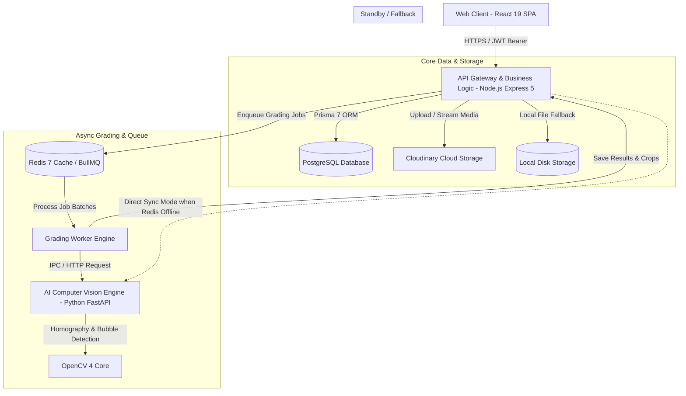

# KIẾN TRÚC HỆ THỐNG DIGITAL EXAM GRADING — THCS V2

> **Định vị sản phẩm:** Nền tảng số hóa toàn diện quy trình tổ chức, nhận dạng thị giác máy tính OMR, chấm thi tự động và công bố kết quả bài thi trắc nghiệm theo định dạng chuẩn Bộ Giáo dục & Đào tạo 2025 dành riêng cho khối trường **Trung học Cơ sở (THCS – Khối 6, 7, 8, 9)**.

---

## 1. TỔNG QUAN PHẠM VI NGHIỆP VỤ (DOMAIN SCOPE)

Hệ thống được thiết kế và tái định hình chuyên sâu cho bậc học **Trung học Cơ sở (THCS)** theo định hướng Chương trình Giáo dục phổ thông mới (GDPT 2018):

* **Phạm vi Khối & Lớp học:**
  * Giới hạn chặt chẽ ở 4 khối: **Khối 6, Khối 7, Khối 8, Khối 9**.
  * Loại bỏ toàn bộ sự phức tạp không liên quan của hệ phổ thông trung học (THPT 10-12), đại học, tín chỉ, học phí, điểm danh, thời khóa biểu, điểm rèn luyện.
* **Quy mô Kỳ thi hỗ trợ:**
  1. **Bài kiểm tra thường xuyên / 15 phút (`REGULAR`, `MIN_15`):** Do Giáo viên bộ môn chủ động tạo, nạp đáp án, tổ chức chấm và công bố kết quả trực tiếp cho lớp phụ trách.
  2. **Kỳ thi Giữa kỳ tập trung (`MIDTERM`):** Do Cán bộ Khảo thí tổ chức toàn trường/toàn khối; Tổ trưởng chuyên môn phê duyệt đáp án gốc; Phó Hiệu trưởng thẩm định và ký duyệt công bố điểm.
  3. **Kỳ thi Cuối kỳ tập trung (`FINAL`):** Do Cán bộ Khảo thí tổ chức; Tổ trưởng chuyên môn duyệt đáp án gốc; quy trình phê duyệt kép 2 vòng (Phó Hiệu trưởng sơ duyệt chuyên môn $\rightarrow$ Hiệu trưởng phê duyệt tối cao công bố).
* **Chuẩn hóa Định dạng Phiếu thi BGD 2025:**
  * Hỗ trợ đầy đủ **Phiếu 20 câu**, **Phiếu 40 câu** và **Phiếu chuẩn Bộ GD&ĐT 2025 (3 Phần)** theo cấu trúc đề thi trắc nghiệm mới nhất của Bộ GD&ĐT.

---

## 2. KIẾN TRÚC TỔNG THỂ & RÕ RÀNG RANH GIỚI HỆ THỐNG (SYSTEM ARCHITECTURE)

Hệ thống áp dụng kiến trúc **Monorepo đa tầng (Multi-tier Monorepo)** với ranh giới phân tách trách nhiệm rõ ràng:



### Chi tiết các tầng thành phần:

1. **Frontend Client (`apps/web`):**
   * Xây dựng trên **React 19**, **Vite 8**, **Tailwind CSS**.
   * Giao diện hiện đại theo chuẩn giáo dục (phong cách thanh điều hướng dọc Azota, Modal, Drawer, Interactive Filter Cards, Badge, Micro-animations).
   * Điều hướng đa vai trò động (`AppHeader`), phản ánh quyền hạn thời gian thực.
2. **Backend API Service (`apps/api`):**
   * Nền tảng **Node.js 22+ / 24+**, framework **Express 5**.
   * Tầng dữ liệu sử dụng **Prisma ORM 7** kết nối **PostgreSQL**.
   * Quản lý bảo mật: JWT Access Token (15m) + Rotating Refresh Token (7d, SHA-256 hash lưu DB), bcrypt hash mật khẩu, CORS whitelist, helmet headers, Zod validation.
   * Xử lý xuất file PDF vector chất lượng cao (300 DPI) bằng thư viện `pdfkit`.
   * Tích hợp **Cloudinary SDK** lưu trữ ảnh bài thi scan, ảnh crop câu hỏi nghi ngờ và thumbnail bài nộp.
3. **AI Computer Vision Engine (`apps/ai-service`):**
   * Nền tảng **Python 3.11+**, framework **FastAPI**.
   * Động cơ xử lý ảnh **OpenCV 4**, **NumPy**, thuật toán căn chỉnh góc phối cảnh (Perspective Transform qua Homography), tự động bù sáng cục bộ (Adaptive Thresholding), giải mã Số Báo Danh và Mã Đề Thi qua ma trận điểm ảnh.
4. **Hệ thống Hàng đợi Chấm bài (Dual-mode Queue Engine):**
   * **Chế độ Phân tán (Distributed Mode):** **Redis 7 + BullMQ**, phân tải chấm hàng loạt bất đồng bộ hàng trăm bài thi cùng lúc, có cơ chế theo dõi tiến độ (progress reporting) và retry tự động khi lỗi mạng.
   * **Chế độ Độc lập (Standalone Synchronous Fallback):** Tự động phát hiện khi môi trường không có Redis (như trên Render Free Tier) để chấm bài tuần tự an toàn mà không làm gián đoạn trải nghiệm người dùng.

---

## 3. MÔ HÌNH PHÂN QUYỀN RBAC 6 VAI TRÒ CHUẨN THCS

Hệ thống thiết lập ma trận phân quyền 6 vai trò (`UserRole`) bảo mật nghiêm ngặt từ Middleware API tới giao diện người dùng:

```
                  ┌──────────────────────┐
                  │     SUPER_ADMIN      │ (Toàn quyền hệ thống & hạ tầng)
                  └──────────┬───────────┘
                             │
            ┌────────────────┴────────────────┐
            ▼                                 ▼
   ┌─────────────────┐               ┌─────────────────┐
   │    PRINCIPAL    │               │  VICE_PRINCIPAL │
   │   (Hiệu trưởng) │               │(Phó Hiệu trưởng)│
   └────────┬────────┘               └────────┬────────┘
            │                                 │
            ├────────────────┬────────────────┤
            ▼                ▼                ▼
   ┌─────────────────┐ ┌───────────┐ ┌─────────────────┐
   │  EXAM_OFFICER   │ │  TEACHER  │ │  SUBJECT_LEADER │
   │ (Cán bộ khảo thí)│ │(Giáo viên)│ │   (Tổ trưởng)   │
   └─────────────────┘ └─────┬─────┘ └─────────────────┘
                             │
                             ▼
                    ┌─────────────────┐
                    │     STUDENT     │
                    │    (Học sinh)   │
                    └─────────────────┘
```

### Bảng Ma trận Quyền hạn Chi tiết:

| Thao tác / Tài nguyên | `SUPER_ADMIN` | `PRINCIPAL` | `VICE_PRINCIPAL` | `EXAM_OFFICER` | `TEACHER` | `STUDENT` |
|---|:---:|:---:|:---:|:---:|:---:|:---:|
| **Quản trị hệ thống, hạ tầng, DB** | ✅ | ❌ | ❌ | ❌ | ❌ | ❌ |
| **Quản lý tài khoản BGH, Cán bộ** | ✅ | ❌ | ❌ | ❌ | ❌ | ❌ |
| **Phân công chuyên môn giáo viên** | ✅ | 👁️ (Xem) | ✅ (Toàn quyền) | ❌ | ❌ | ❌ |
| **Tạo, sửa, xóa Lớp học & Học sinh** | ✅ | 👁️ (Xem) | ✅ (Toàn quyền) | ❌ | ❌ | ❌ |
| **Xem học sinh lớp được phân công** | ✅ | ✅ | ✅ | ✅ | ✅ (Đầy đủ SBD, tài khoản) | ❌ |
| **Xem học sinh lớp khác trong trường** | ✅ | ✅ | ✅ | ✅ | 👁️ **Chỉ xem (Read-only)** | ❌ |
| **Tạo bài kiểm tra thường xuyên** | ❌ | ❌ | ❌ | ❌ | ✅ (Lớp phân công) | ❌ |
| **Tạo kỳ thi chính thức (Giữa/Cuối kỳ)**| ❌ | ❌ | ❌ | ✅ (Toàn quyền) | ❌ | ❌ |
| **Phê duyệt Bảng đáp án gốc (Master Key)**| ❌ | ❌ | ❌ | ❌ | ✅ *(Chỉ Tổ trưởng đúng môn)* | ❌ |
| **Chấm bài OMR & Hậu kiểm (Review)** | ❌ | ❌ | ❌ | ✅ (Kỳ thi tập trung) | ✅ (Bài kiểm tra lớp mình) | ❌ |
| **Phê duyệt công bố điểm Giữa kỳ** | ❌ | ❌ | ✅ (Phê duyệt) | ❌ | ❌ | ❌ |
| **Phê duyệt công bố điểm Cuối kỳ** | ❌ | ✅ (Phê duyệt tối cao) | 👁️ (Sơ duyệt vòng 1) | ❌ | ❌ | ❌ |
| **Xem Trung tâm Thống kê & Phổ điểm** | ✅ | ✅ | ✅ | ✅ | ✅ | ❌ |
| **Tra cứu điểm thi cá nhân** | ❌ | ❌ | ❌ | ❌ | ❌ | ✅ *(Khi đã công bố)* |

### Cơ chế Tổ trưởng Chuyên môn (Subject Leader Mechanism)
* Không dùng chuỗi văn bản tự do (`title`) để kiểm tra quyền hạn.
* Định danh qua cờ dữ liệu: `Teacher.isSubjectLeader = true` và `Teacher.primarySubjectId`.
* **Quy tắc bất biến:** Một giáo viên chỉ được duyệt bảng đáp án gốc của kỳ thi nếu `isSubjectLeader === true` VÀ `primarySubjectId === exam.subjectId`. Ngay cả Hiệu trưởng, Hiệu phó hay Cán bộ khảo thí cũng không thể tự tiện duyệt thay nếu không đúng phân công chuyên môn.

### Quy định Đặc thù: Quản lý Lớp học & Học sinh (`/classes`)
* **Ban Giám Hiệu (`VICE_PRINCIPAL`, `SUPER_ADMIN`):** Nắm quyền CRUD tuyệt đối (Tạo lớp hàng loạt, đổi tên lớp, chuyển khối, nạp danh sách học sinh từ Excel, thêm/sửa/xóa học sinh, xóa toàn bộ học sinh lớp, chuẩn hóa SBD 6 số).
* **Giáo viên chuyên môn (`TEACHER`):**
  * **Tại lớp mình phụ trách:** Gắn huy hiệu `"Lớp phụ trách"`. Được xem danh sách học sinh, mã học sinh, Số báo danh, ngày sinh và tài khoản/mật khẩu tra cứu để hỗ trợ học sinh tại phòng thi và đối chiếu kết quả.
  * **Tại lớp khác trong trường:** Được quyền xem danh sách và Số báo danh ở chế độ **Chỉ xem (Read-only)**, gắn huy hiệu `"Chỉ xem"`. Hệ thống ẩn hoàn toàn nút *Tạo lớp*, *Sửa lớp*, *Xóa lớp*, *Thêm học sinh*, *Import Excel*, *Chuẩn hóa SBD*, *Xóa tất cả*, ẩn cột *Thao tác* và checkbox chọn hàng loạt, đồng thời hiển thị thông báo nghiệp vụ rõ ràng nhằm chống mọi hành vi sửa đổi dữ liệu trái phép.

---

## 4. MẪU PHIẾU TRẢ LỜI TRẮC NGHIỆM CHUẨN BỘ GIÁO DỤC 2025

Hệ thống hỗ trợ 3 quy chuẩn phiếu thi trắc nghiệm A4 vector sắc nét:

```
┌─────────────────────────────────────────────────────────────┐
│ [Corner Marker]        TRƯỜNG THCS ...      [Corner Marker] │
│                       PHIẾU TRẢ LỜI OMR                     │
│                                                             │
│ ┌──────────────┐ ┌──────────────┐ ┌───────────────────────┐ │
│ │  MÃ ĐỀ THI   │ │ SỐ BÁO DANH  │ │     MÃ NHẬN DIỆN      │ │
│ │   [0] [0] [1]│ │ [0][6][0][1] │ │     [QR / Barcode]    │ │
│ └──────────────┘ └──────────────┘ └───────────────────────┘ │
│                                                             │
│ ┌─────────────────────────────────────────────────────────┐ │
│ │ PHẦN I: TRẮC NGHIỆM 4 LỰA CHỌN (Câu 1 - 40: A, B, C, D) │ │
│ ├─────────────────────────────────────────────────────────┤ │
│ │ PHẦN II: TRẮC NGHIỆM ĐÚNG / SAI (8 Câu: Ý a, b, c, d)   │ │
│ ├─────────────────────────────────────────────────────────┤ │
│ │ PHẦN III: TRẢ LỜI NGẮN / ĐIỀN SỐ (6 Câu: - / + / Số)   │ │
│ └─────────────────────────────────────────────────────────┘ │
│ [Corner Marker]       Bản quyền Digital Exam [Corner Marker] │
└─────────────────────────────────────────────────────────────┘
```

### 1. Phiếu 20 câu trắc nghiệm (Dành cho kiểm tra 15 phút, thường xuyên)
* 20 câu hỏi trắc nghiệm nhiều lựa chọn tiêu chuẩn (A, B, C, D).
* Mã đề 3 số (001 - 999), Số báo danh 6 số (`KKLLSS`).

### 2. Phiếu 40 câu trắc nghiệm (Dành cho kiểm tra 1 tiết, giữa kỳ cũ)
* 40 câu hỏi trắc nghiệm nhiều lựa chọn tiêu chuẩn (A, B, C, D).
* Bố cục 2 hoặc 4 cột cân đối, tối ưu hóa diện tích trang giấy A4.

### 3. Phiếu BGD 2025 Chuẩn GDPT 2018 (3 Phần Chuyên sâu)
Đáp ứng chính xác quy chế thi tốt nghiệp và kiểm tra đánh giá định kỳ mới nhất của Bộ GD&ĐT:
* **Phần I — Câu trắc nghiệm nhiều phương án lựa chọn (40 câu):**
  * Thí sinh chọn 1 phương án đúng trong 4 phương án A, B, C, D.
  * Mỗi câu trả lời đúng được tính điểm theo thang quy định.
* **Phần II — Câu trắc nghiệm Đúng / Sai (8 câu hỏi):**
  * Mỗi câu hỏi có 4 ý diễn đạt độc lập **a, b, c, d**.
  * Thí sinh chọn Đúng (Đ) hoặc Sai (S) cho từng ý.
  * **Thuật toán chấm điểm lũy tiến chuẩn BGD:**
    * Đúng 1 ý: tính $0.1$ điểm.
    * Đúng 2 ý: tính $0.25$ điểm.
    * Đúng 3 ý: tính $0.5$ điểm.
    * Đúng cả 4 ý: tính $1.0$ điểm tối đa.
* **Phần III — Câu trắc nghiệm trả lời ngắn / Điền số (6 câu hỏi):**
  * Thí sinh điền kết quả dạng số vào khung lưới.
  * Hỗ trợ dấu âm ($-$), dấu dương ($+$), phần nguyên và phần số thập phân.
* **Quy chuẩn Kỹ thuật In ấn & Nhận dạng:**
  * Khổ giấy chuẩn: **A4 (210 x 297 mm)**, in tỉ lệ thực tế `100% (Actual Size)`.
  * **4 Điểm định vị góc (Corner Fiducial Markers):** Dấu vuông đặc kích thước $10 \times 10\text{ mm}$ ở 4 góc để thuật toán Homography xác định hệ quy chiếu toạ độ phẳng chính xác tuyệt đối ngay cả khi giấy thi bị chụp xiên, nghiêng hoặc xoay góc.
  * **Mã nhận diện Barcode / QR Code:** Chứa metadata mã kỳ thi, mã môn, mã định dạng phiếu để máy tự động cấu hình lưới chấm mà không cần người dùng chọn thủ công.

---

## 5. BỘ LỌC THỐNG KÊ ĐA CHIỀU & BÁO CÁO TOÀN DIỆN

Hệ thống trang bị Trung tâm Thống kê & Báo cáo kết quả trực quan phục vụ cho công tác điều hành của BGH và quản lý điểm số của Giáo viên:

```
[BỘ LỌC ĐA CHIỀU] ──┬──► Theo Khối (Tất cả, Khối 6, Khối 7, Khối 8, Khối 9)
                    ├──► Theo Lớp học (Tự động lọc danh sách lớp thuộc Khối đã chọn)
                    ├──► Theo Môn học (Toán học, Ngữ văn, Tiếng Anh, Hóa học, Tin học...)
                    └──► Theo Giáo viên (Lọc theo giáo viên phụ trách / giảng dạy)
```

### Khả năng tính toán động thời gian thực (Real-time Analytics):
* **Tổng quan định lượng:** Số lượng kỳ thi, số bài nộp, số bài đã chấm chính thức, số bài cần hậu kiểm danh tính/câu hỏi.
* **Phổ điểm chuẩn sư phạm:**
  * **Loại Giỏi:** Điểm từ $8.0 \ đến \ 10.0$.
  * **Loại Khá:** Điểm từ $6.5 \ đến \ 7.99$.
  * **Loại Trung bình:** Điểm từ $5.0 \ đến \ 6.49$.
  * **Dưới Trung bình:** Điểm dưới $5.0$.
* **Chỉ số chất lượng:** Điểm số trung bình toàn khối/lớp/môn/giáo viên; tỷ lệ bài nộp hợp lệ; phân bố kết quả nhận diện thị giác OMR (Tô đúng, Tô nhiều ô, Để trống, Nghi ngờ).
* **Danh sách chi tiết trực quan:** Top giáo viên hoạt động tích cực, bảng theo dõi các kỳ thi mới nhất và danh sách bài nộp gần đây kèm điểm số tức thì.

---

## 6. MÁY TRẠNG THÁI KỲ THI & NGUYÊN TẮC BẤT BIẾN DỮ LIỆU

### Vòng đời Trạng thái Kỳ thi (Exam State Machine)

```
[DRAFT] ──────► [PUBLISHED] ──────► [CLOSED] ──────► [PUBLICATION APPROVED] ──────► [ARCHIVED]
(Thiết lập)     (Đang thi & Chấm)   (Khóa bài thi)   (Phê duyệt & Công bố điểm)      (Lưu trữ lịch sử)
```

* **Quy tắc Bất biến của Bảng Đáp Án (AnswerKey Immutability):**
  * Ngay khi kỳ thi phát sinh bài nộp đầu tiên (`submissionsCount > 0`), hệ thống lập tức khóa cứng bảng đáp án gốc.
  * Mọi API thêm, sửa, xóa mã đề hay đáp án đều bị chặn (`409 Conflict - ANSWER_KEY_IMMUTABLE_ONCE_SUBMISSIONS_EXIST`).
  * Nếu đề thi còn ở `DRAFT` và giáo viên chỉnh sửa đáp án, cờ phê duyệt `answerKeyApprovedAt` lập tức bị hủy bỏ (`null`), buộc Tổ trưởng chuyên môn phải thẩm định lại từ đầu.
* **Quy trình Phê duyệt Công bố Điểm (Atomic Publication Workflow):**
  * Kỳ thi chỉ được gửi yêu cầu phê duyệt khi $100\%$ bài nộp đã đạt trạng thái `FINAL` và không còn bài nào nghi vấn danh tính / trùng SBD chưa giải quyết.
  * Phê duyệt là một **Giao dịch nguyên tử (Atomic Database Transaction)**: Đồng thời cập nhật trạng thái phê duyệt `APPROVED`, ghi dấu thời gian `resultsPublishedAt = NOW()`, định danh người duyệt `resultsPublishedByUserId` và mở quyền tra cứu điểm cho học sinh.

---

## 7. CẤU TRÚC THƯ MỤC MONOREPO

```text
DigitalExamGrading/
│
├── apps/
│   ├── api/                          # REST API & Business Core (Node.js Express 5)
│   │   ├── prisma/
│   │   │   ├── schema.prisma         # Mô hình dữ liệu PostgreSQL THCS chuẩn
│   │   │   └── migrations/           # Lịch sử migration Prisma ORM
│   │   ├── src/
│   │   │   ├── config/               # Cấu hình Prisma, Cloudinary, Redis, Environment
│   │   │   ├── controllers/          # Controllers (Auth, Exam, Class, Submission, Dashboard...)
│   │   │   ├── middlewares/          # Auth, RBAC, Validation, Error, Upload middlewares
│   │   │   ├── routes/               # API Routes bảo vệ theo vai trò
│   │   │   ├── services/             # Nghiệp vụ: Chấm thi, OMR, Phê duyệt, Excel, Lớp học...
│   │   │   └── utils/                # Answer sheet layout BGD 2025, SBD generator, Sort tiếng Việt...
│   │   └── tests/                    # 18 test suites / 173 ca kiểm thử tự động
│   │
│   ├── ai-service/                   # Thị giác máy tính nhận dạng OMR (Python FastAPI)
│   │   ├── app/
│   │   │   ├── main.py               # FastAPI application endpoints
│   │   │   ├── omr/                  # Thuật toán Homography, Grid registration, Bubble scanner
│   │   │   └── models/               # Pydantic schemas dữ liệu tọa độ & kết quả OMR
│   │   └── tests/                    # 37 ca kiểm thử thị giác máy tính OpenCV
│   │
│   └── web/                          # Frontend SPA (React 19 + Vite 8 + Tailwind CSS)
│       ├── src/
│       │   ├── api/                  # Axios HTTP client cấu hình token interceptors
│       │   ├── components/           # UI components, AppHeader, Modals, Breadcrumbs, Badges...
│       │   ├── context/              # AuthContext quản lý session người dùng
│       │   ├── pages/                # Các trang giao diện theo vai trò (BGH, Khảo thí, Giáo viên, Học sinh)
│       │   └── utils/                # Formatters, Enum mappers, Vietnamese helpers
│       └── package.json
│
├── compose.yaml                      # Cấu hình Docker Compose (PostgreSQL, Redis, AI Service)
├── render.yaml                       # Blueprint triển khai tự động lên hạ tầng Render Cloud
└── README.md                         # Hướng dẫn tổng quan dự án
```

---

## 8. CHỈ SỐ KIỂM ĐỊNH CHẤT LƯỢNG (TEST & VERIFICATION SUITE)

Hệ thống được kiểm tra nghiêm ngặt qua 3 tầng kiểm thử trước khi bàn giao:

1. **Backend API & Business Logic:**
   * **18 test suites / 173 automated tests — Tỷ lệ đạt: 100% (173/173 PASSED)**.
   * Kiểm thử chạy trên cơ sở dữ liệu cô lập `exam_grading_test`, tự động reset dữ liệu an toàn.
   * Bao phủ toàn bộ các kịch bản: RBAC, tính bất biến đáp án, giao dịch nguyên tử phê duyệt, bộ lọc thống kê đa chiều, chuẩn hóa SBD tiếng Việt.
2. **AI Computer Vision Engine:**
   * **37/37 automated tests — Tỷ lệ đạt: 100% (37/37 PASSED)**.
   * Đảm bảo khả năng chịu lỗi trước ảnh nghiêng góc tới $25^\circ$, độ sáng lệch, bóng đổ nhẹ và phiếu in bị co giãn.
3. **Frontend Production Build:**
   * `vite build` biên dịch sạch **100% không cảnh báo lỗi**.
   * Hệ thống tuân thủ nghiêm ngặt ESLint và các tiêu chuẩn Clean Code.
